# AI Agent Ecosystem

A comprehensive collection of specialized AI agents designed to work together as a coordinated team for solving complex, multi-domain challenges. This ecosystem provides professional-grade expertise across all aspects of software development, data processing, user experience, and business operations.

## 📑 Table of Contents

- [Overview](#-overview)
- [Agent Architecture](#-agent-architecture)
- [How It Works](#-how-it-works)
- [Agent Coordination Architecture](#-agent-coordination-architecture)
- [Common Workflow Patterns](#-common-workflow-patterns)
- [Tools & Automation](#-tools--automation)
- [Best Practices for Usage](#-best-practices-for-usage)
- [Universal Application Examples](#-universal-application-examples)
- [Installation & Setup](#-installation--setup)
- [Advanced Usage](#-advanced-usage)
- [Troubleshooting](#-troubleshooting)
- [FAQ](#-faq)
- [Support & Community](#-support--community)
- [Contributing](#-contributing)
- [License](#-license)

## 🎯 Overview

This repository contains **48 professional AI agents** that collaborate to deliver exceptional results across any project type or industry. Each agent is a specialist in their domain, designed to work seamlessly with others through structured coordination protocols.

### **What Makes This Special**

- **Universal Applicability**: Works for any project type across all industries
- **Professional Standards**: Enterprise-grade agents with deep expertise
- **Coordinated Intelligence**: Agents work together, not in isolation
- **Clear Boundaries**: No overlapping responsibilities, distinct specializations
- **Scalable Architecture**: From simple scripts to enterprise-scale systems
- **Consistent Descriptions**: All agents use standardized, action-oriented capability descriptions for easy discovery
- **Intelligent Discovery**: Tools for automated agent selection, lazy loading, and progress tracking
- **Token Efficient**: 93% token reduction through lazy loading and agent summaries

## 🏗️ Agent Architecture

### **Coordination Layer** (5 Agents)
The orchestration brain of the ecosystem:
- **`strategic-task-planner`**: Primary orchestrator for complex multi-step projects
- **`leverage-ai-agents`**: Meta-coordinator for agent ecosystem optimization
- **`auto-agent-generator`**: Dynamic agent creation and ecosystem expansion specialist
- **`web-server-pm`**: Project management for web server development initiatives
- **`product-manager`**: Product strategy, roadmap planning, and stakeholder management

### **Core Technical Foundation** (13 Agents)
Essential building blocks for any technical project:
- **`system-architecture-designer`**: High-level system design and architectural decisions
- **`backend-architect`**: Server-side architecture and API design
- **`database-implementation-specialist`**: Database design, optimization, and implementation
- **`frontend-ux-expert`**: User interface development and experience optimization
- **`platform-engineer`**: Internal developer platforms and golden path creation
- **`developer-experience-engineer`**: Developer productivity and workflow optimization
- **`code-reviewer`**: Code quality assurance and best practices enforcement
- **`fullstack-dev-expert`**: Comprehensive full-stack development expertise
- **`mobile-development-specialist`**: iOS/Android native and cross-platform development
- **`cloud-architecture-specialist`**: AWS/Azure/GCP cloud-native architecture
- **`api-design-specialist`**: REST/GraphQL/gRPC API design and implementation
- **`prompt-engineer`**: LLM optimization, prompt design, and AI workflow implementation

### **Data & Intelligence Systems** (7 Agents)
Transform data into intelligent features:
- **`data-engineering-specialist`**: Data pipeline design and processing workflows
- **`ai-ml-specialist`**: Machine learning model implementation and NLP systems
- **`mlops-engineer`**: ML model deployment, monitoring, and production operations
- **`data-science-specialist`**: Business intelligence and statistical analysis
- **`real-time-systems-specialist`**: Performance optimization and concurrent processing
- **`integration-specialist`**: System integration, ETL/ELT, and API connectivity
- **`ai-ethics-governance-specialist`**: Responsible AI development and compliance frameworks

### **User Experience & Communication** (7 Agents)
Create exceptional user experiences:
- **`messaging-platform-specialist`**: Conversational interfaces and messaging integration
- **`localization-specialist`**: Internationalization and cultural adaptation
- **`ui-ux-designer`**: User interface design and experience architecture
- **`content-management-specialist`**: Digital content organization and workflow management
- **`accessibility-specialist`**: WCAG compliance and inclusive design
- **`technical-writing-specialist`**: API documentation and user guides
- **`developer-relations-engineer`**: Developer community building and external engagement

### **Security & Operations** (7 Agents)
Ensure reliability and security:
- **`web-security-specialist`**: Security implementation and compliance
- **`web-performance-specialist`**: Performance optimization and Core Web Vitals
- **`devops-infrastructure-specialist`**: Infrastructure deployment and CI/CD
- **`qa-reliability-engineer`**: Testing frameworks and system reliability
- **`production-validation-specialist`**: Production readiness and deployment validation
- **`sre-specialist`**: Site reliability engineering and incident response
- **`monitoring-observability-specialist`**: Metrics, logging, and alerting

### **Business & Marketing** (8 Agents)
Drive business success:
- **`ecommerce-specialist`**: E-commerce systems and payment processing
- **`seo-marketing-specialist`**: Search optimization and digital marketing
- **`documentation-research-specialist`**: Technical documentation and research
- **`web-search-specialist`**: Web research and competitive intelligence specialist
- **`legal-compliance-specialist`**: GDPR, CCPA, HIPAA compliance
- **`cost-optimization-specialist`**: Cloud cost optimization and FinOps
- **`business-analyst`**: Requirements analysis and stakeholder management
- **`solutions-engineer`**: Pre-sales technical support and customer solution design

### **Specialized Industry Domains** (2 Agents)
Domain-specific expertise:
- **`art-gallery-specialist`**: Art gallery operations and creative industry expertise
- **`image-ai-specialist`**: Advanced image processing and computer vision

## 🚀 How It Works

### **1. Strategic Planning**
Every project starts with the **`strategic-task-planner`** who:
- Analyzes project requirements and breaks them into manageable components
- Identifies dependencies and optimal sequencing
- Selects the right combination of specialist agents
- Creates detailed execution roadmaps with milestones

### **2. Agent Coordination**
The **`leverage-ai-agents`** coordinator:
- Designs optimal agent collaboration patterns
- Manages handoffs between specialists
- Ensures efficient workflow and prevents bottlenecks
- Monitors quality and performance across all agents

### **3. Specialist Execution**
Each specialist agent:
- Brings deep domain expertise to their specific area
- Follows structured workspace management protocols
- Documents decisions and deliverables for seamless handoffs
- Validates quality before passing work to the next agent

## 🏛️ Agent Coordination Architecture

Our agent coordination follows a sophisticated complexity-based delegation pattern that ensures optimal resource utilization and project success:

```mermaid
graph TD
    A[User Request] --> B{Project Complexity Assessment}

    B -->|Simple Projects<br/>1-3 Agents<br/>Sequential Workflow| C[Strategic Task Planner]
    B -->|Complex Projects<br/>4+ Agents<br/>Parallel Workflows| D[Leverage AI Agents]

    C --> E[Task Decomposition]
    C --> F[Agent Selection]
    C --> G[Sequential Coordination]

    G -->|If Complexity Exceeds Threshold| H[Escalate to Leverage AI Agents]
    H --> D

    D --> I[Multi-Agent Orchestration]
    D --> J[Parallel Stream Management]
    D --> K[Performance Optimization]
    D --> L[Complex Coordination Patterns]

    G --> M[🪝 Hooks Active Throughout]
    I --> M
    J --> M
    M --> N[Command Execution<br/>Progress Tracking<br/>Auto-Continue]

    subgraph "Simple Project Flow (80% of cases)"
        C
        E
        F
        G
    end

    subgraph "Complex Project Flow (20% of cases)"
        D
        I
        J
        K
        L
    end

    subgraph "Automation Layer 🪝"
        M
        N
    end

    style A fill:#e1f5fe,stroke:#01579b,stroke-width:2px
    style C fill:#f3e5f5,stroke:#4a148c,stroke-width:2px
    style D fill:#e8f5e8,stroke:#1b5e20,stroke-width:2px
    style H fill:#fff3e0,stroke:#e65100,stroke-width:2px
    style M fill:#ffd700,stroke:#ff8c00,stroke-width:3px
    style N fill:#ffd700,stroke:#ff8c00,stroke-width:2px
```



This architecture ensures that:
- **80% of projects** get efficient, streamlined coordination through the strategic-task-planner
- **20% of complex projects** get sophisticated multi-agent orchestration
- **Clear escalation paths** prevent coordination bottlenecks
- **Proper delegation** maintains agent specialization boundaries
- **Automation layer (🪝 Hooks)** enhances all workflows with instant command execution, progress tracking, and auto-continuation

## 📋 Common Workflow Patterns

### **Sequential Development Flow**
```
Requirements → Architecture → Data Setup → Backend → Frontend → Security → Deployment
```
**Perfect for**: Traditional web applications, enterprise systems

### **Data-Driven Application Flow**
```
Data Engineering → AI/ML Implementation → Analytics → Real-time Optimization
```
**Perfect for**: AI-powered applications, recommendation systems, analytics platforms

### **Global Platform Flow**
```
Localization Planning → Messaging Design → Cultural Adaptation → Performance Optimization
```
**Perfect for**: Multi-regional applications, international marketplaces

### **Parallel Development**
Multiple agents work simultaneously on independent components:
- AI model training + Database design + Frontend development
- Security implementation + Performance optimization + Documentation

## 🛠️ Tools & Automation

The ecosystem includes powerful tools for intelligent agent discovery, token efficiency, and progress tracking. All tools are automatically installed and can be used by both agents and users.

### **🔍 Available Tools**

#### **1. Capability Discovery** (`tools/capability_discovery.py`)
**Purpose:** Find the right agents for your requirements automatically

**Agent Usage:**
```bash
# Find agents by requirement
tools/capability_discovery.py --find "REST API design"
# Returns: api-design-specialist (0.95), backend-architect (0.87)

# Recommend optimal team for project
tools/capability_discovery.py --recommend "e-commerce platform"
# Returns: 5-7 agent team with dependencies

# Generate capability report
tools/capability_discovery.py --report
```

**How Agents Use It:**
Agents can discover specialists by executing this tool via Bash:
```markdown
I'll find the right specialist for database work:
<execute via Bash tool>
./tools/capability_discovery.py --find "database optimization"
</execute>
```

---

#### **2. Lazy Loader** (`tools/lazy_loader.py`)
**Purpose:** Token-efficient agent loading (93% token reduction)

**Agent Usage:**
```bash
# List all available agents (lightweight directory)
tools/lazy_loader.py --list
# Returns: All 48 agents, ~100 tokens

# Load agent summary only (~250 tokens vs ~1000)
tools/lazy_loader.py --summary backend-architect

# Activate full agent definition when needed
tools/lazy_loader.py --activate backend-architect

# Check what's currently loaded
tools/lazy_loader.py --status
```

**Token Efficiency:**
```
Traditional: Load all 48 agents = 48,000 tokens
With Lazy Loading:
  - Directory: ~100 tokens
  - Summaries (5 agents): ~1,250 tokens
  - Full (2 active): ~2,000 tokens
  → Total: ~3,350 tokens (93% savings!)
```

**How Agents Use It:**
Coordination agents should load summaries first, then activate full definitions only when executing:
```markdown
First, I'll check available backend specialists:
<execute via Bash tool>
./tools/lazy_loader.py --list | grep backend
</execute>

Now I'll load the backend architect's summary:
<execute via Bash tool>
./tools/lazy_loader.py --summary backend-architect
</execute>

Since we need full expertise, activating complete definition:
<execute via Bash tool>
./tools/lazy_loader.py --activate backend-architect
</execute>
```

---

#### **3. Progress Tracking** (`tools/parse-progress.py`)
**Purpose:** Parse and analyze workspace progress files

**Agent Usage:**
```bash
# Parse progress markdown
tools/parse-progress.py workspaces/SHARED_PROGRESS.md

# Export to JSON for programmatic access
tools/parse-progress.py workspaces/SHARED_PROGRESS.md --json report.json

# Quick shell analysis
tools/analyze-progress.sh workspaces/SHARED_PROGRESS.md

# Validate format compliance
tools/validate-progress.sh workspaces/SHARED_PROGRESS.md
```

---

#### **4. Summary Generation** (`tools/generate_summaries.py`)
**Purpose:** Regenerate agent summaries after modifications

```bash
# Regenerate all summaries
tools/generate_summaries.py

# Regenerate for specific category
tools/generate_summaries.py --category core-technical
```

---

#### **5. Error Handling** (`tools/error_handling.py`)
**Purpose:** Reusable error handling utilities for consistent recovery patterns

---

### **📚 How Agents Know About Tools**

**1. Documentation Files:**
All installations include these protocol documents:
- `TOKEN_EFFICIENCY.md` - Explains lazy loading and how to use `lazy_loader.py`
- `CAPABILITY_DISCOVERY.md` - Explains agent selection and how to use `capability_discovery.py`
- `QUICK_REFERENCE.md` - Quick command reference for all tools

**2. Agent Instructions:**
Coordination agents (like `strategic-task-planner`) have built-in knowledge:
```yaml
# In agent frontmatter:
capabilities:
  command_execution: [bash, python]

# In agent prompt:
"When you need to find specialists, use: ./tools/capability_discovery.py --find <requirement>"
"For token efficiency, load summaries first: ./tools/lazy_loader.py --summary <agent>"
```

**3. Runtime Discovery:**
Agents can list available tools:
```bash
ls tools/
# Shows: capability_discovery.py, lazy_loader.py, parse-progress.py, etc.
```

---

### **🎯 Tool Usage Patterns**

**Pattern 1: Agent Discovery**
```
strategic-task-planner:
  → Uses capability_discovery.py to find specialists
  → Loads summaries of candidates via lazy_loader.py
  → Selects best match
  → Activates full definition when delegating
```

**Pattern 2: Token Optimization**
```
leverage-ai-agents:
  → Loads directory (all 48 agents, ~100 tokens)
  → Loads summaries for relevant agents (~250 tokens each)
  → Activates only agents that will execute (~1000 tokens each)
  → Result: 93% token savings
```

**Pattern 3: Progress Coordination**
```
Any agent:
  → Checks SHARED_PROGRESS.md via parse-progress.py
  → Identifies completed vs pending tasks
  → Updates progress after completing work
  → Validates format with validate-progress.sh
```

---

### **Installation**

Tools are automatically installed with agents:

```bash
# Standard installation (includes tools)
python3 install-agents.py .cursor/rules --all

# For Claude Code
python3 install-agents.py <your-dir> --all

# For Claude Desktop
python3 install-agents.py .claude/agents --claude --all
```

**Verification:**
```bash
# Check tools are installed
ls <installation-dir>/tools/

# Test capability discovery
<installation-dir>/tools/capability_discovery.py --find "test"

# Test lazy loader
<installation-dir>/tools/lazy_loader.py --list
```

---

### **🔗 See Also**

- **TOKEN_EFFICIENCY.md** - Detailed lazy loading architecture
- **CAPABILITY_DISCOVERY.md** - Agent selection system details
- **QUICK_REFERENCE.md** - Quick command reference
## 🎯 Best Practices for Usage

### **Start with Strategy**
Always begin with **`@strategic-task-planner`** to:
- Understand project requirements and scope
- Get a detailed execution plan with proper sequencing
- Identify which specialist agents you'll need

### **Leverage Agent Consultation**
During execution, agents can dynamically consult specialists:
- Lead agents maintain task ownership while getting expert input
- Consultations are marked with `[CONSULT]` for clarity
- Multiple specialists can be consulted for comprehensive solutions
- All consultations are documented in the lead agent's workspace

### **Use Coordination for Complex Projects**
For projects requiring 3+ agents, engage **`@leverage-ai-agents`** to:
- Design optimal agent collaboration workflows
- Prevent bottlenecks and overlapping work
- Ensure quality handoffs between specialists

### **Agent Selection Guidelines**

**For Data Work:**
- **Data Pipeline Development**: `@data-engineering-specialist`
- **Database Design & Optimization**: `@database-implementation-specialist`
- **Business Intelligence & Analytics**: `@data-science-specialist`
- **AI Model Implementation**: `@ai-ml-specialist`

**For User Experience:**
- **Web Interface Development**: `@frontend-ux-expert`
- **Conversational Interfaces**: `@messaging-platform-specialist`
- **Global/Multi-language Apps**: `@localization-specialist`
- **UX Design & Research**: `@ui-ux-designer`

**For Performance & Security:**
- **System Performance**: `@real-time-systems-specialist`
- **Web Performance**: `@web-performance-specialist`
- **Security Implementation**: `@web-security-specialist`
- **Production Deployment**: `@devops-infrastructure-specialist`

**For Business Applications:**
- **E-commerce Features**: `@ecommerce-specialist`
- **SEO & Marketing**: `@seo-marketing-specialist`
- **Project Management**: `@web-server-pm`
- **Technical Documentation**: `@documentation-research-specialist`
- **Web Research & Competitive Intelligence**: `@web-search-specialist`

### **Quality Assurance**
- Each agent validates their work before handoff
- Use **`@code-reviewer`** for code quality assurance and best practices enforcement
- Use **`@qa-reliability-engineer`** for comprehensive testing
- Use **`@production-validation-specialist`** before deployment
- Regular check-ins with coordination agents for complex projects

## 🌍 Universal Application Examples

### **E-commerce Platform**
```
Strategic Planning → System Architecture → Data Engineering →
AI Recommendations → E-commerce Features → Performance Optimization →
Security Implementation → Production Deployment
```

### **SaaS Application**
```
Requirements Analysis → Database Design → Backend API →
Frontend Dashboard → Real-time Features → Security Compliance →
Performance Testing → Global Deployment
```

### **Global Marketplace**
```
Localization Strategy → Multi-region Architecture →
Messaging Platform → Cultural Adaptation → Payment Processing →
Performance Optimization → Compliance Validation
```

### **AI-Powered Analytics Platform**
```
Data Pipeline Design → ML Model Implementation →
Real-time Processing → Business Intelligence →
Interactive Dashboard → Performance Optimization →
Production Monitoring
```

## 🔧 Installation & Setup

### **Easy Installation (Recommended)**

Use the provided installation scripts to automatically copy agents to your `.cursor/rules` directory:

#### **Python Script (Recommended)**
```bash
# Standard installation (48 agents + 10 docs + summaries + tools)
python3 install-agents.py .cursor/rules --all

# Minimal installation (48 agents + 6 essential docs)
python3 install-agents.py .cursor/rules --all --minimal-docs

# Full installation (48 agents + 12 docs including developer guides)
python3 install-agents.py .cursor/rules --all --include-dev-docs

# Install specific categories
python3 install-agents.py .cursor/rules --category coordination core-technical

# Install specific agents
python3 install-agents.py .cursor/rules --agents strategic-task-planner ai-ml-specialist

# For Claude Code (same commands)
python3 install-agents.py <your-dir> --all

# For Claude Desktop (converts to .md format)
python3 install-agents.py .claude/agents --claude --all

# List available options
python3 install-agents.py --list-categories
python3 install-agents.py --list-agents
python3 install-agents.py --list-by-category
```

**What Gets Installed:**
- ✅ 48 specialized AI agents (v2.1.0)
- ✅ 6-12 protocol documents (based on tier)
- ✅ 48 agent summaries (93% token reduction)
- ✅ 7 automation tools (capability discovery, lazy loading, etc.)
- ✅ NO hooks or commands (replaced by universal tools)

#### **Windows Users**
Use the Python script or manually copy files:
```cmd
python install-agents.py "C:\Users\YourName\.cursor\rules" --all
```

### **Manual Installation**

#### **For Cursor IDE Users**
1. Copy agent `.mdc` files from `agents/` subdirectories to your `.cursor/rules/` directory
2. Copy required documentation files: `WORKSPACE_PROTOCOLS.md`, `TEAM_COLLABORATION_CULTURE.md`, `AGENT_DIRECTORY.md`, `agent-coordination-guide.md`, and `AGENT_HIERARCHY.md`
3. Restart Cursor IDE to load the agents
4. Use `@agent-name` syntax to engage specific agents

#### **For Other IDEs**
1. Integrate agent descriptions into your AI assistant configuration
2. Use the agent expertise descriptions as context for your AI interactions
3. Follow the coordination patterns for complex projects

### **Verification**
After installation, test that agents are working:
```
@strategic-task-planner: Hello, test message
```

## 📚 Advanced Usage

### **Custom Agent Combinations**
Create project-specific agent teams:
```markdown
For Data Science Project:
@strategic-task-planner → @data-engineering-specialist →
@data-science-specialist → @ai-ml-specialist → @web-performance-specialist
```

### **Iterative Development**
Use feedback loops with coordination agents:
```markdown
@strategic-task-planner (initial plan) → Agent execution →
@leverage-ai-agents (optimization) → Refinement → Quality validation
```

### **Cross-Domain Expertise**
Combine specialized knowledge:
```markdown
Art Gallery + E-commerce: @art-gallery-specialist + @ecommerce-specialist
AI + Messaging: @ai-ml-specialist + @messaging-platform-specialist
Performance + Security: @real-time-systems-specialist + @web-security-specialist
Research + Documentation: @web-search-specialist + @documentation-research-specialist
```

### **Creating New Specialized Agents**
When your project requires domain expertise not covered by existing agents:
```markdown
@auto-agent-generator: Create a [domain]-specialist agent for [specific expertise area]

Example:
@auto-agent-generator: Create a blockchain-development-specialist agent for smart contract development and DeFi protocols
```

The auto-agent-generator will:
- Gather requirements through clarifying questions
- Read the agent template from `templates/agent_template.mdc`
- Fill all placeholders with agent-specific content
- Write the completed agent to `agents/{category}/agent-name.mdc`
- Provide guidance on post-creation integration

**Template Files:**
- `templates/agent_template.mdc` - Main agent structure with placeholders
- `templates/specialist_checklist.yaml` - For specialist agents (most agents)
- `templates/coordinator_checklist.yaml` - For coordinator agents

### **Dynamic Agent Consultation**
Agents can consult other specialists during task execution without switching personas:
```markdown
backend-architect: "I'm designing the authentication system..."
[CONSULT] web-security-specialist: "Implement OAuth 2.0 with PKCE, use JWT with short expiry"
backend-architect: "Excellent, incorporating these security measures..."
```

**Common Consultation Patterns:**
- **Security Reviews**: Any agent can consult `@web-security-specialist`
- **Code Quality**: All agents consult `@code-reviewer` for best practices
- **Performance**: Technical agents consult `@web-performance-specialist`
- **Research**: Any agent can consult `@web-search-specialist` for market data
- **Design**: Frontend agents consult `@ui-ux-designer` for UX decisions

## 🔧 Troubleshooting

### Installation Issues

#### Agent Not Recognized After Installation
**Symptom**: Typing `@agent-name` doesn't trigger the agent

**Solutions**:
1. **Restart Cursor IDE** - Most common fix. Close and reopen Cursor completely
2. **Verify Installation Path**:
   ```bash
   ls ~/.cursor/rules/*.mdc
   # Should show all agent .mdc files
   ```
3. **Check File Permissions**:
   ```bash
   chmod 644 ~/.cursor/rules/*.mdc
   ```
4. **Validate .mdc Format** - Ensure frontmatter is valid YAML
5. **Check Cursor Console** - Look for agent loading errors

#### Files Not Copying During Installation
**Symptom**: Installation script runs but files missing

**Solutions**:
1. Run with verbose output to see what's happening
2. Check source directory exists and contains .mdc files
3. Ensure write permissions on `.cursor/rules/` directory
4. Try manual copy as fallback

### Agent Usage Issues

#### Multiple Agents Responding Simultaneously
**Symptom**: Several agents try to handle the same request

**Solutions**:
1. **Use Specific Mentions**: Always use `@agent-name` for specific agent
2. **Check alwaysApply Settings**: Some agents may have `alwaysApply: true`
3. **Be Explicit**: Say "I want only @backend-architect to handle this"

#### Agent Giving Generic Responses
**Symptom**: Agent doesn't use specialized expertise

**Solutions**:
1. **Verify Agent Loaded**: Check response starts with correct identifier (e.g., "backend-architect:")
2. **Provide Context**: Give agent more context about your specific needs
3. **Review Agent Description**: Ensure task matches agent's specialization
4. **Use Strategic Planner**: Let `@strategic-task-planner` select optimal agent

#### Wrong Agent Selected for Task
**Symptom**: Task assigned to inappropriate agent

**Solutions**:
1. **Start with Strategic Planner**: Always use `@strategic-task-planner` for complex tasks
2. **Review Agent Directory**: Check agent capabilities in category READMEs
3. **Ask for Recommendation**: Request agent selection advice before starting

### Coordination Issues

#### Agents Not Coordinating Properly
**Symptom**: Handoffs between agents failing or incomplete

**Solutions**:
1. **Use Coordination Agents**: Engage `@strategic-task-planner` or `@leverage-ai-agents`
2. **Check Workspace**: Verify agents are updating progress appropriately
3. **Sequential Execution**: Ensure agents complete before next starts
4. **Clear Dependencies**: Make task dependencies explicit

#### Project Too Complex for One Session
**Symptom**: Running out of context or hitting limits

**Solutions**:
1. **Break Into Phases**: Divide project into smaller, manageable phases
2. **Document Progress**: Keep clear notes between sessions
3. **Clear Handoff Points**: Define explicit stopping and starting points
4. **Save Deliverables**: Ensure all work products saved to files

### Performance Issues

#### Slow Agent Responses
**Symptom**: Agent taking long time to respond

**Solutions**:
1. **Simplify Request**: Break complex requests into smaller tasks
2. **Reduce Context**: Clear irrelevant context from conversation
3. **Sequential Not Parallel**: Work with one agent at a time
4. **Check System Resources**: Verify Cursor IDE performance

#### Too Many Agents Loaded
**Symptom**: IDE performance degraded with all 48 agents

**Solutions**:
1. **Selective Installation**: Install only needed categories:
   ```bash
   python install-agents.py ~/.cursor/rules --category coordination core-technical
   ```
2. **Project-Specific Agents**: Install agents per project need
3. **Unload Unused Agents**: Remove .mdc files for unused agents

### Quality Issues

#### Deliverables Don't Meet Expectations
**Symptom**: Agent output not matching requirements

**Solutions**:
1. **Clarify Requirements**: Provide more detailed specifications
2. **Use Quality Gates**: Engage `@code-reviewer` or `@qa-reliability-engineer`
3. **Iterative Refinement**: Work through multiple refinement cycles
4. **Show Examples**: Provide examples of expected output

## ❓ FAQ

### General Questions

#### Q: Do I need to install all 48 agents?
**A**: No! You can install:
- **All agents**: `--all` flag (recommended for full capability)
- **Specific categories**: `--category coordination core-technical`
- **Individual agents**: `--agents strategic-task-planner backend-architect`

Choose based on your project needs.

#### Q: Which agent should I start with?
**A**:
- **For any multi-step project**: Start with `@strategic-task-planner`
- **For single, simple task**: Directly engage the specialist agent
- **For complex coordination**: Use `@strategic-task-planner` → `@leverage-ai-agents`

#### Q: Can I use these agents with existing codebases?
**A**: Absolutely! Agents can:
- Analyze existing code
- Suggest improvements
- Add new features
- Refactor and modernize
- Review code quality
- Add tests and documentation

#### Q: How do agents coordinate with each other?
**A**: Through structured workspace protocols:
- Agents update progress with status
- Create deliverable files in shared workspace
- Reference each other's work
- Follow documented handoff procedures

See `docs/agent-coordination-guide.md` for details.

### Technical Questions

#### Q: What's the difference between strategic-task-planner and leverage-ai-agents?
**A**:
- **strategic-task-planner**: Handles simple-moderate projects (1-3 agents, sequential workflows)
- **leverage-ai-agents**: Handles complex projects (4+ agents, parallel workflows, optimization)

Strategic-task-planner escalates to leverage-ai-agents when complexity warrants it.

#### Q: Can I create my own custom agents?
**A**: Yes! Two ways:
1. **Recommended**: Use `@auto-agent-generator` to create agents that follow ecosystem standards
2. **Manual**: Follow template in `agents/coordination/STREAMLINED_AGENT_TEMPLATE.md`

#### Q: How do I know which agent to use for my task?
**A**: Three approaches:
1. **Ask Strategic Planner**: `@strategic-task-planner: I need to [describe task]`
2. **Check Agent Directory**: Review category READMEs for agent capabilities
3. **Browse Categories**: Look at category READMEs for overviews

#### Q: What if two agents have overlapping capabilities?
**A**: Agents are designed with distinct, non-overlapping specializations:
- Each has clear scope boundaries
- Descriptions specify "USE WHEN" conditions
- Coordination agents help select optimal agent
- Agents can consult each other when needed

If you find overlaps, please report as an issue!

#### Q: Can agents work in parallel on different parts of a project?
**A**: Yes! Use `@leverage-ai-agents` for parallel coordination:
- Identifies independent work streams
- Manages multiple agents simultaneously
- Synchronizes at integration points
- Optimizes workflow efficiency

### Project Questions

#### Q: How long does a typical project take with agents?
**A**: Depends on project scope:
- **Small projects**: 1-2 days (2-3 agents)
- **Medium projects**: 1-2 weeks (4-6 agents)
- **Large projects**: 4-8 weeks (8-12 agents)
- **Enterprise projects**: 2-6 months (15+ agents)

Agents accelerate but don't eliminate development time.

#### Q: What types of projects work best with this ecosystem?
**A**: The ecosystem is universal and works for:
- ✅ Web applications (SaaS, e-commerce, content sites)
- ✅ Mobile applications (iOS, Android, cross-platform)
- ✅ AI/ML projects (models, pipelines, analytics)
- ✅ APIs and microservices
- ✅ Data processing and analytics
- ✅ Cloud infrastructure and DevOps
- ✅ Global/multilingual applications
- ✅ Enterprise systems

#### Q: Do I need technical knowledge to use the agents?
**A**:
- **Basic Projects**: Non-technical users can use strategic-task-planner for guidance
- **Complex Projects**: Technical knowledge helpful for quality assessment
- **Implementation**: Technical skills needed to evaluate and implement agent suggestions
- **Strategic Decisions**: Business stakeholders can engage product-manager and business-analyst

#### Q: What if I get stuck mid-project?
**A**:
1. Review workspace context
2. Consult `@strategic-task-planner` for next steps
3. Engage `@code-reviewer` for quality check
4. Break project into smaller phases
5. Ask in community channels
6. Review troubleshooting section above

### Performance & Limits

#### Q: Are there limits to how many agents I can use?
**A**: Technical limits:
- **IDE Performance**: All 48 agents may slow some systems
- **Context Limits**: Very complex projects may need phase breaks
- **Coordination Complexity**: 15+ agents in parallel needs careful coordination

Practical limits:
- Most projects use 4-8 agents
- Sequential execution more manageable than parallel
- Break large projects into phases

#### Q: How do I optimize performance with many agents?
**A**:
1. Install only needed categories
2. Work sequentially when possible
3. Clear context between major phases
4. Use coordination agents for workflow optimization
5. Save deliverables to files regularly

### Troubleshooting

#### Q: Agent isn't responding to @mentions
**A**: See "Agent Not Recognized After Installation" in Troubleshooting section above.

#### Q: How do I report bugs or request features?
**A**:
- **Bugs**: GitHub Issues with reproduction steps
- **Features**: GitHub Issues with use case description
- **Questions**: GitHub Discussions or community channels

## 💬 Support & Community

### Getting Help

#### Documentation
- 📖 **Start Here**: This README for ecosystem overview
- 📁 **Category Guides**: `agents/[category]/README.md` for category-specific guidance
- 🎯 **Agent Details**: Individual `.mdc` files for agent capabilities
- 📚 **Coordination Guide**: `docs/agent-coordination-guide.md` for multi-agent workflows
- 🚀 **Quick Start**: `docs/quick-start-guide.md` for fast onboarding

#### Community Support
- 💬 **Discussions**: GitHub Discussions - Ask questions, share experiences
- 🐛 **Bug Reports**: GitHub Issues - Report bugs with reproduction steps
- 💡 **Feature Requests**: GitHub Issues - Suggest improvements
- 📧 **Contact**: For private or security issues

#### Getting Answers
1. **Search Documentation**: Check this README and category guides first
2. **Search Issues**: Someone may have asked already
3. **Ask in Discussions**: Community can help with common questions
4. **File Issue**: For bugs or unclear documentation

### Success Stories

**Share your experience**: Did the AI Agent Ecosystem help your project? We'd love to hear about it!
- Add to Discussions
- Share your use case
- Contribute examples

## 🤝 Contributing

We welcome contributions to the AI Agent Ecosystem! Whether you're creating new agents, improving existing ones, enhancing documentation, or sharing examples, your contributions help make this ecosystem better for everyone.

### Quick Start for Contributors

1. Fork the repository
2. Create a feature branch
3. Make your changes following our guidelines
4. Test thoroughly
5. Submit a pull request

### Types of Contributions

- 🎯 **New Agents**: Use `@auto-agent-generator` for consistency
- 📝 **Documentation**: Improve READMEs, add examples, fix typos
- 🐛 **Bug Fixes**: Fix issues with agent behavior or coordination
- ✨ **Enhancements**: Improve existing agent capabilities
- 📚 **Examples**: Share your success stories and use cases

**See [CONTRIBUTING.md](CONTRIBUTING.md) for detailed guidelines** including:
- Agent development standards
- PR process and requirements
- Testing guidelines
- Code of conduct
- How to report issues

### Agent Development Guidelines

- Each agent must have a distinct, non-overlapping specialty
- Follow the workspace management protocol
- Include comprehensive expertise descriptions
- Maintain professional tone and deep technical knowledge
- Keep .mdc files under 400 lines for optimal Cursor performance
- Use **`@auto-agent-generator`** for creating new agents to ensure consistency

## 📄 License

This AI Agent Ecosystem is designed for professional use across any industry or project type. Each agent represents years of expertise condensed into actionable, coordinated intelligence.

---

**Transform how you approach complex challenges. Instead of working alone, work with a team of 48 specialized professionals who never sleep, never forget, and always coordinate perfectly.**

**Ready to get started? Begin with `@strategic-task-planner` and watch your project come together with professional precision.**