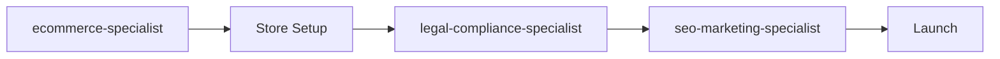
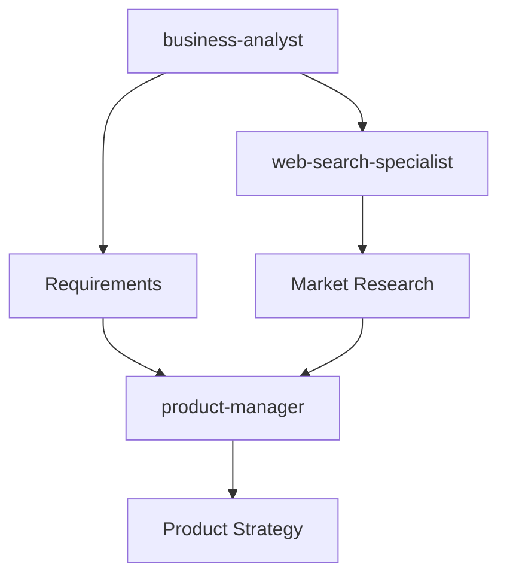
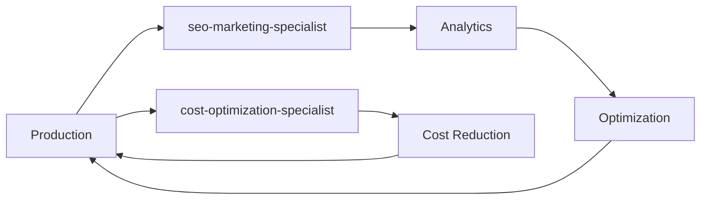

# Business & Marketing Agents

Specialists driving business success through e-commerce, marketing optimization, research, compliance, and business analysis.

## Overview

The Business & Marketing category contains **8 specialist agents** that focus on business value creation - from implementing e-commerce functionality and SEO optimization to research, compliance, and business analysis. These agents bridge technical implementation with business objectives.

These agents are essential for **revenue generation, market research, regulatory compliance, and business strategy**. They ensure your technical solutions deliver measurable business value.

**Agent Count**: 8 business & marketing specialists
**Typical Project Phase**: Business Strategy & Optimization (Throughout project)
**Dependencies**: Often needs technical implementation from other categories
**Enables**: Revenue growth, market expansion, compliance, strategic direction

---

## Agents in This Category

### E-Commerce & Sales Tier

#### ecommerce-specialist
**Use When**: Online store setup, payment processing, shopping carts, product catalogs
**Delivers**: E-commerce implementation, payment integrations, conversion optimization
**Integrates With**: backend-architect, web-security-specialist
**Typical Timeline**: 2-4 weeks for e-commerce setup

**Key Capabilities**:
- Stripe, PayPal, Square integration
- Shopping cart and checkout optimization
- Product catalog management
- Order fulfillment workflows
- Abandoned cart recovery
- PCI DSS compliance

#### seo-marketing-specialist
**Use When**: Search optimization, content strategy, digital marketing, analytics
**Delivers**: SEO audits, content plans, marketing campaigns, performance reports
**Integrates With**: content-management-specialist, web-performance-specialist
**Typical Timeline**: Ongoing for SEO, 1-2 weeks for campaigns

**Key Capabilities**:
- Technical SEO optimization
- Content strategy and planning
- Keyword research
- Link building
- Google Analytics/Search Console
- Marketing automation

### Research & Analysis Tier

#### web-search-specialist
**Use When**: Market research, competitive intelligence, trend analysis, data gathering
**Delivers**: Research reports, competitive analysis, market insights
**Integrates With**: business-analyst, product-manager
**Typical Timeline**: 1 week for research project

**Key Capabilities**:
- Competitive intelligence
- Market trend analysis
- Industry research
- Technology landscape analysis
- Best practice identification

#### documentation-research-specialist
**Use When**: Technical documentation research, standards analysis, compliance research
**Delivers**: Research summaries, technical documentation, reference materials
**Integrates With**: technical-writing-specialist, legal-compliance-specialist
**Typical Timeline**: 1 week for research project

#### business-analyst
**Use When**: Requirements gathering, stakeholder management, business process analysis
**Delivers**: Requirements documents, process maps, business cases
**Integrates With**: product-manager, strategic-task-planner
**Typical Timeline**: 1-2 weeks for analysis phase

**Key Capabilities**:
- Requirements elicitation
- Stakeholder management
- Process modeling
- Business case development
- Gap analysis
- User story creation

### Compliance & Optimization Tier

#### legal-compliance-specialist
**Use When**: GDPR, CCPA, HIPAA compliance, privacy policies, terms of service
**Delivers**: Compliance documentation, privacy policies, consent workflows
**Integrates With**: web-security-specialist, ai-ethics-governance-specialist
**Typical Timeline**: 1-2 weeks for compliance setup

**Key Capabilities**:
- GDPR/CCPA compliance
- Privacy policy creation
- Cookie consent management
- Data retention policies
- Terms of service
- Regulatory compliance

#### cost-optimization-specialist
**Use When**: Cloud cost optimization, FinOps, resource efficiency, budget management
**Delivers**: Cost analysis, optimization recommendations, budget forecasts
**Integrates With**: cloud-architecture-specialist, devops-infrastructure-specialist
**Typical Timeline**: 1 week for cost audit

**Key Capabilities**:
- Cloud cost analysis
- Resource optimization
- Reserved instance planning
- Cost allocation
- Budget alerts
- FinOps practices

### Solutions Engineering Tier

#### solutions-engineer
**Use When**: Pre-sales support, technical presentations, customer solutions, POCs
**Delivers**: Solution designs, technical presentations, POC implementations
**Integrates With**: system-architecture-designer, product-manager
**Typical Timeline**: Variable per customer engagement

---

## When to Use This Category

### Scenario 1: Launching E-Commerce Business
**Sequence**: `@ecommerce-specialist → @web-security-specialist → @seo-marketing-specialist`
**Timeline**: 4-6 weeks
**Outcome**: Online store with payment processing and marketing strategy

**Example**:
```
Project: Boutique fashion e-commerce store

Week 1-2: E-Commerce Setup
@ecommerce-specialist:
- Shopify Plus configuration
- Product catalog (500 items)
- Shopping cart and checkout
- Stripe payment integration
- Inventory management
- Order fulfillment workflow

Week 3: Security & Compliance
@web-security-specialist:
- PCI DSS compliance
- SSL/TLS configuration
- Secure payment flow

@legal-compliance-specialist:
- Privacy policy
- Terms of service
- GDPR compliance (EU customers)
- Cookie consent

Week 4: Marketing Launch
@seo-marketing-specialist:
- Product page SEO
- Google Shopping feed
- Email marketing setup
- Social media strategy
- Launch campaign

Result: $50K revenue in first month, 2.5% conversion rate
```

### Scenario 2: Product Requirements & Strategy
**Sequence**: `@business-analyst → @product-manager → @strategic-task-planner`
**Timeline**: 2-3 weeks
**Outcome**: Clear requirements and product strategy

### Scenario 3: Market Entry Research
**Sequence**: `@web-search-specialist → @business-analyst`
**Timeline**: 1-2 weeks
**Outcome**: Market analysis and competitive intelligence

### Scenario 4: Cost Optimization
**Sequence**: `@cost-optimization-specialist → @cloud-architecture-specialist`
**Timeline**: 1 week
**Outcome**: 30-40% cloud cost reduction

---

## Usage Patterns

### Pattern 1: E-Commerce Launch



**Best For**: Online stores, digital products
**Timeline**: 4-6 weeks

### Pattern 2: Product Development



**Best For**: New products, feature planning
**Timeline**: 2-4 weeks

### Pattern 3: Continuous Optimization



**Best For**: Ongoing operations
**Timeline**: Continuous

---

## Integration with Other Categories

### Drives Technical Requirements
- E-commerce specialist defines technical needs for backend-architect
- Business analyst provides requirements for all technical agents
- Compliance specialist sets security requirements

### Optimizes Outcomes
- SEO specialist optimizes frontend and content
- Cost specialist optimizes infrastructure
- Solutions engineer bridges technical and business

---

## Success Criteria

### E-Commerce
- [ ] Payment processing working
- [ ] Product catalog complete
- [ ] Checkout conversion optimized
- [ ] Order fulfillment automated
- [ ] PCI DSS compliant

### Marketing & SEO
- [ ] SEO audit completed
- [ ] Target keywords ranking
- [ ] Organic traffic growing
- [ ] Conversion rate improving
- [ ] Analytics tracking configured

### Compliance
- [ ] Privacy policy published
- [ ] GDPR/CCPA compliance implemented
- [ ] Cookie consent working
- [ ] Data retention policies defined
- [ ] Regulatory requirements met

### Business Analysis
- [ ] Requirements documented
- [ ] Stakeholders aligned
- [ ] Business case approved
- [ ] Success metrics defined
- [ ] ROI projected

---

## Common Issues & Solutions

### Issue 1: Low E-Commerce Conversion
**Symptom**: Traffic but few sales

**Solution**:
1. **@ecommerce-specialist**: Analyze checkout funnel
2. **@seo-marketing-specialist**: Review traffic quality
3. **@ui-ux-designer**: Optimize checkout UX
4. A/B test improvements

### Issue 2: Compliance Gaps
**Symptom**: Non-compliance with regulations

**Solution**:
1. **@legal-compliance-specialist**: Audit current state
2. Prioritize compliance gaps
3. **@web-security-specialist**: Implement technical controls
4. Document compliance measures

### Issue 3: High Cloud Costs
**Symptom**: Unexpected infrastructure costs

**Solution**:
1. **@cost-optimization-specialist**: Analyze spending
2. Identify waste (unused resources, over-provisioning)
3. **@cloud-architecture-specialist**: Implement optimizations
4. Set up budget alerts

### Issue 4: Unclear Requirements
**Symptom**: Development blocked by ambiguity

**Solution**:
1. **@business-analyst**: Facilitate requirements workshop
2. Create user stories with acceptance criteria
3. Get stakeholder sign-off
4. **@product-manager**: Prioritize backlog

---

## Best Practices

1. **Business Case First**: Validate business value before building

2. **Compliance Early**: Don't retrofit privacy and compliance

3. **SEO from Start**: Build SEO into architecture, not add later

4. **Monitor Costs**: Track cloud spending from day one

5. **Data-Driven Decisions**: Use analytics to guide strategy

6. **Customer Research**: Talk to real customers regularly

7. **Continuous Optimization**: Marketing and costs need ongoing attention

---

## Quick Reference

### Agent Selection by Need

| Your Need | Primary Agent | Supporting Agents |
|-----------|---------------|-------------------|
| Online store | @ecommerce-specialist | @web-security-specialist |
| SEO/Marketing | @seo-marketing-specialist | @content-management-specialist |
| Market research | @web-search-specialist | @business-analyst |
| Requirements | @business-analyst | @product-manager |
| Compliance | @legal-compliance-specialist | @web-security-specialist |
| Cost optimization | @cost-optimization-specialist | @cloud-architecture-specialist |
| Documentation | @documentation-research-specialist | @technical-writing-specialist |
| Pre-sales | @solutions-engineer | @system-architecture-designer |

### Typical Timeline
- **E-commerce setup**: 2-4 weeks
- **SEO audit**: 1 week
- **Market research**: 1 week
- **Business analysis**: 1-2 weeks
- **Compliance setup**: 1-2 weeks
- **Cost optimization**: 1 week

---

## Examples

### Example 1: SaaS Product Launch
**Timeline**: 6 weeks

```
Week 1-2: Requirements & Research
@web-search-specialist:
- Competitive analysis (10 competitors)
- Market trends and pricing research

@business-analyst:
- Stakeholder interviews
- Requirements documentation
- User personas

Week 3-4: Compliance & Strategy
@legal-compliance-specialist:
- Privacy policy and terms
- GDPR compliance framework

@seo-marketing-specialist:
- Content strategy
- Keyword research
- Launch plan

Week 5-6: Launch & Optimization
@seo-marketing-specialist:
- Launch campaign
- Google Ads setup
- Email marketing

@cost-optimization-specialist:
- Set cost budgets
- Configure alerts

Result: 500 sign-ups in launch week, $5K MRR by month 2
```

### Example 2: Enterprise Sales Support
**Ongoing**

```
@solutions-engineer:
- Pre-sales technical presentations
- Custom solution designs
- POC implementations (2-week cycles)
- Technical Q&A support

Integration with:
- @system-architecture-designer: Architecture diagrams
- @web-security-specialist: Security documentation
- @business-analyst: Requirements capture

Result: 40% increase in enterprise deal closure rate
```

---

*For technical implementation, see [`../core-technical/README.md`](../core-technical/README.md)*
*For product strategy, see [`../coordination/README.md`](../coordination/README.md)*
