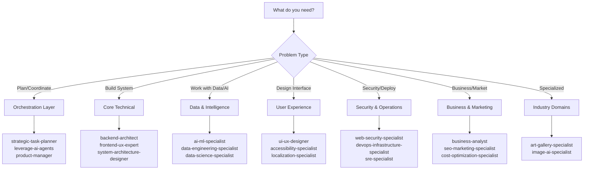

# Agent Directory

## 📖 Purpose

**Use this directory to:**
- **Discover agents** by expertise area when planning projects
- **Find the right specialist** for specific technical challenges
- **Understand collaboration patterns** between agents
- **Plan workflows** by identifying required agents and their dependencies
- **Quick reference** when you need "Who handles X?" answers

**When to use this:**
- Starting a new project and need to select the right agent team
- Current agent suggests consulting another specialist
- Looking for an agent with specific domain expertise
- Planning complex multi-agent workflows

---

## 🔍 How to Find the Right Agent

### Quick Selection Guide



### By Common Need

| I Need To... | Start With Agent |
|--------------|------------------|
| Plan a complex project | `strategic-task-planner` |
| Coordinate 4+ agents | `leverage-ai-agents` |
| Design system architecture | `system-architecture-designer` |
| Build an API | `backend-architect` + `api-design-specialist` |
| Create user interface | `ui-ux-designer` → `frontend-ux-expert` |
| Implement AI/ML features | `ai-ml-specialist` |
| Optimize performance | `web-performance-specialist` |
| Secure application | `web-security-specialist` |
| Deploy to production | `devops-infrastructure-specialist` |
| Analyze data | `data-science-specialist` |
| Market research | `web-search-specialist` |
| Ensure accessibility | `accessibility-specialist` |

---

## 💡 Usage Examples

### Example 1: E-Commerce Platform Project

**Goal**: Build full-featured e-commerce platform

**Agent Selection Process**:
1. **Check Business & Marketing** → Found `ecommerce-specialist` ✓
2. **Check Core Technical** → Found `backend-architect`, `frontend-ux-expert` ✓
3. **Check Data Intelligence** → Found `ai-ml-specialist` (for recommendations) ✓
4. **Check Security & Operations** → Found `web-security-specialist`, `devops-infrastructure-specialist` ✓

**Recommended Workflow**:
```
strategic-task-planner (planning)
  ↓
system-architecture-designer (architecture)
  ↓
[Parallel Streams]
  Stream A: backend-architect + ecommerce-specialist + database-implementation-specialist
  Stream B: ai-ml-specialist + data-engineering-specialist (recommendation engine)
  Stream C: ui-ux-designer + frontend-ux-expert
  ↓
web-security-specialist (security review)
  ↓
devops-infrastructure-specialist (deployment)
```

### Example 2: AI-Powered Analytics Dashboard

**Goal**: Real-time analytics dashboard with ML predictions

**Agent Selection Process**:
1. **Check Data Intelligence** → Found `data-engineering-specialist`, `ai-ml-specialist`, `data-science-specialist` ✓
2. **Check Core Technical** → Found `backend-architect`, `real-time-systems-specialist` ✓
3. **Check User Experience** → Found `ui-ux-designer`, `frontend-ux-expert` ✓

**Recommended Workflow**:
```
strategic-task-planner
  ↓
system-architecture-designer
  ↓
data-engineering-specialist (data pipelines)
  ↓
[Parallel]
  - ai-ml-specialist + mlops-engineer (ML models)
  - data-science-specialist (analytics)
  - backend-architect + real-time-systems-specialist (API + real-time)
  ↓
ui-ux-designer → frontend-ux-expert (dashboard UI)
  ↓
web-performance-specialist (optimization)
```

### Example 3: Global SaaS Application

**Goal**: Multi-tenant SaaS with international support

**Agent Selection Process**:
1. **Check Orchestration** → Found `product-manager`, `strategic-task-planner` ✓
2. **Check Core Technical** → Found `cloud-architecture-specialist`, `backend-architect` ✓
3. **Check User Experience** → Found `localization-specialist`, `accessibility-specialist` ✓
4. **Check Security** → Found `web-security-specialist`, `legal-compliance-specialist` ✓

**Recommended Workflow**:
```
product-manager + strategic-task-planner (strategy)
  ↓
system-architecture-designer + cloud-architecture-specialist (cloud-native design)
  ↓
[Parallel Streams]
  Stream A: backend-architect + api-design-specialist + database-implementation-specialist
  Stream B: ui-ux-designer + frontend-ux-expert + localization-specialist
  Stream C: web-security-specialist + legal-compliance-specialist (GDPR/compliance)
  ↓
qa-reliability-engineer (testing)
  ↓
devops-infrastructure-specialist + sre-specialist (deployment + monitoring)
```

### Example 4: "I Don't Know Which Agent I Need"

**Scenario**: Need to improve website loading speed

**Step-by-Step**:
1. Search this directory for "performance" → Found `web-performance-specialist` ✓
2. Read description: "Performance optimization and Core Web Vitals"
3. Check collaboration patterns → Often works with `frontend-ux-expert`, `backend-architect`
4. **Decision**: Start with `@web-performance-specialist`
5. Agent may consult others as needed

**Scenario**: Need to add payment processing

**Step-by-Step**:
1. Check Business & Marketing category → Found `ecommerce-specialist` ✓
2. Read description: "E-commerce systems and payment processing"
3. Check collaboration patterns → Works with `backend-architect`, `web-security-specialist`
4. **Decision**: Start with `@ecommerce-specialist` + consult `@web-security-specialist`

---

## ✅ Success Criteria

**You've found the right agent(s) when:**
- ✅ Agent's description clearly matches your problem domain
- ✅ Agent has the specific technical expertise you need
- ✅ You understand which agents come before/after (dependencies clear)
- ✅ The collaboration pattern makes sense for your workflow
- ✅ You can articulate why this agent vs another similar one

**Red flags (wrong agent selected):**
- ❌ Agent description is vague or doesn't match your need
- ❌ You're forcing a fit ("maybe they can do this too...")
- ❌ Multiple agents seem to overlap completely (check AGENT_HIERARCHY.md for clarity)
- ❌ No clear handoff to/from this agent

---

## 📋 Available Specialist Agents

### Primary Orchestration Layer

- **strategic-task-planner**: Primary orchestrator for complex multi-step projects and strategic planning
- **leverage-ai-agents**: Meta-coordinator for complex multi-agent orchestration (4+ agents, parallel workflows)
- **auto-agent-generator**: Dynamic agent creation and ecosystem expansion specialist
- **web-server-pm**: Project management for web server development initiatives
- **product-manager**: Product strategy, roadmap planning, and stakeholder management

### Core Technical Foundation

- **system-architecture-designer**: High-level system design and architectural decisions
- **backend-architect**: Server-side architecture and API design
- **database-implementation-specialist**: Database design, optimization, and implementation
- **frontend-ux-expert**: User interface development and experience optimization
- **platform-engineer**: Internal developer platforms and golden path creation
- **developer-experience-engineer**: Developer productivity and workflow optimization
- **code-reviewer**: Code quality assurance and best practices enforcement
- **fullstack-dev-expert**: Comprehensive full-stack development expertise
- **mobile-development-specialist**: iOS/Android native and cross-platform development
- **cloud-architecture-specialist**: AWS/Azure/GCP cloud-native architecture and optimization
- **api-design-specialist**: REST/GraphQL/gRPC API design and implementation
- **prompt-engineer**: LLM optimization, prompt design, and AI workflow implementation

### Data & Intelligence Systems

- **data-engineering-specialist**: Data pipeline design and processing workflows
- **ai-ml-specialist**: Machine learning model implementation and NLP systems
- **mlops-engineer**: ML model deployment, monitoring, and production operations
- **data-science-specialist**: Business intelligence and statistical analysis
- **real-time-systems-specialist**: Performance optimization and concurrent processing
- **integration-specialist**: System integration, ETL/ELT, and API connectivity
- **ai-ethics-governance-specialist**: Responsible AI development and compliance frameworks

### User Experience & Communication

- **messaging-platform-specialist**: Conversational interfaces and messaging integration
- **localization-specialist**: Internationalization and cultural adaptation
- **ui-ux-designer**: User interface design and experience architecture
- **content-management-specialist**: Digital content organization and workflow management
- **accessibility-specialist**: WCAG compliance and inclusive design implementation
- **technical-writing-specialist**: API docs, user guides, and technical documentation
- **developer-relations-engineer**: Developer community building and external engagement

### Security & Operations

- **web-security-specialist**: Security implementation and compliance
- **web-performance-specialist**: Performance optimization and Core Web Vitals
- **devops-infrastructure-specialist**: Infrastructure deployment and CI/CD
- **qa-reliability-engineer**: Testing frameworks and system reliability
- **production-validation-specialist**: Production readiness and deployment validation
- **sre-specialist**: Site reliability engineering, monitoring, and incident response
- **monitoring-observability-specialist**: Metrics, logging, tracing, and alerting

### Business & Marketing

- **business-analyst**: Requirements analysis and stakeholder management
- **solutions-engineer**: Pre-sales technical support and customer solution design
- **ecommerce-specialist**: E-commerce systems and payment processing
- **seo-marketing-specialist**: Search optimization and digital marketing
- **documentation-research-specialist**: Technical documentation and research
- **web-search-specialist**: Web research and competitive intelligence specialist
- **legal-compliance-specialist**: GDPR, CCPA, HIPAA, and regulatory compliance
- **cost-optimization-specialist**: Cloud cost optimization and FinOps practices

### Specialized Industry Domains

- **art-gallery-specialist**: Art gallery operations and creative industry expertise
- **image-ai-specialist**: Advanced image processing and computer vision

## Common Agent Collaboration Patterns

### Sequential Technical Dependencies
1. `web-search-specialist` → `system-architecture-designer` → `data-engineering-specialist` → `database-implementation-specialist` → `backend-architect` → `code-reviewer`
2. `documentation-research-specialist` → `ai-ml-specialist` → `data-science-specialist` → `web-performance-specialist` → `code-reviewer`
3. `web-search-specialist` → `messaging-platform-specialist` → `localization-specialist` → `web-security-specialist` → `frontend-ux-expert` → `code-reviewer`

### Parallel Development Streams
- Market research and competitive analysis concurrent with technical architecture design
- AI/ML model training parallel with database and backend development
- User interface development concurrent with data processing implementation
- Performance optimization and security hardening developed simultaneously

### Universal Consultation Matrix
- **All Agents** have to consult `code-reviewer` for quality assurance
- **All Agents** should consult `web-search-specialist` for research and market intelligence
- **Technical Agents** should frequently consult `web-security-specialist` and `web-performance-specialist`
- **Frontend Agents** should regularly consult `ui-ux-designer` and `localization-specialist`
- **Data Agents** should often consult `ai-ml-specialist` and `data-science-specialist`
- **Business Agents** should consult `seo-marketing-specialist` and `documentation-research-specialist`