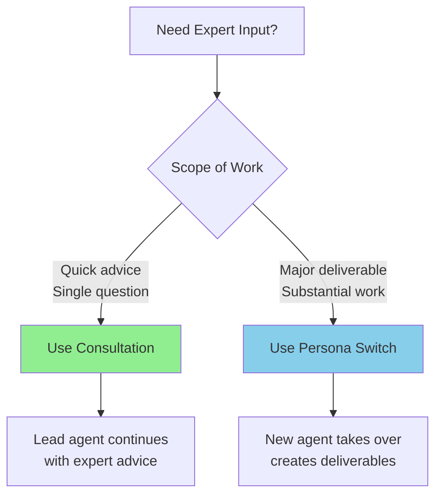
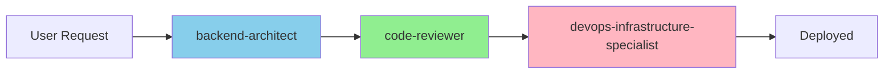
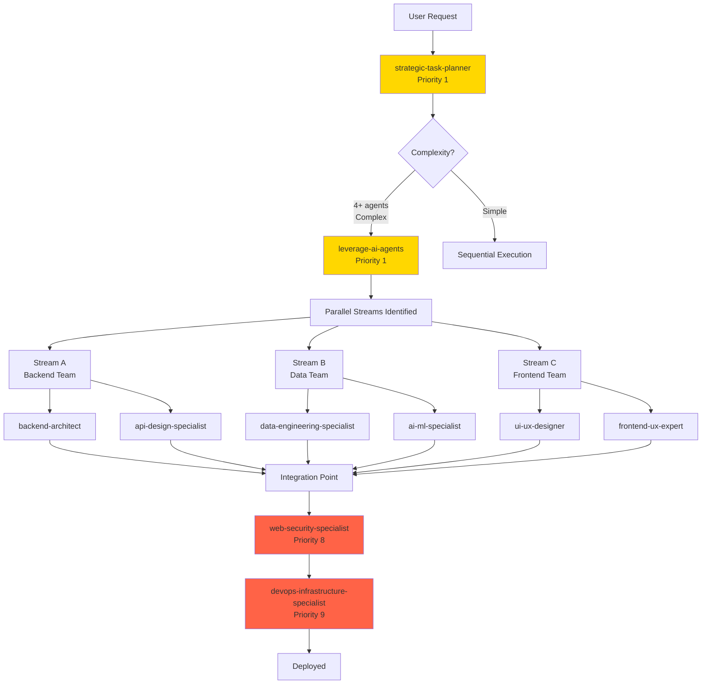
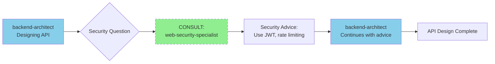
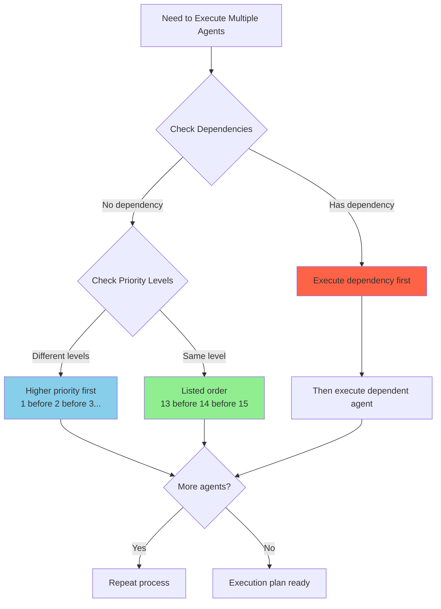

# AI Agent Ecosystem Hierarchy

## Agent Priority & Execution Order

This document defines the hierarchical priority order for agent execution when multiple agents are involved in a task. Agents are organized by priority level (1 being highest) and execution sequence within each level.

### **Priority Level 1: Coordination & Planning**
1. **strategic-task-planner** - Primary orchestrator, always executes first
2. **leverage-ai-agents** - Meta-coordinator for multi-agent workflows
3. **auto-agent-generator** - Agent creation when specialized capabilities needed
4. **product-manager** - Product strategy and roadmap planning

### **Priority Level 2: Research & Requirements**
5. **web-search-specialist** - Market research and competitive intelligence
6. **documentation-research-specialist** - Technical documentation and knowledge gathering
7. **business-analyst** - Requirements analysis and stakeholder management

### **Priority Level 3: Architecture & Design**
8. **system-architecture-designer** - High-level system design
9. **ui-ux-designer** - User interface design and experience architecture
10. **cloud-architecture-specialist** - Cloud-native architecture and multi-cloud strategies
11. **api-design-specialist** - REST/GraphQL/gRPC API design and documentation

### **Priority Level 4: Data Foundation**
12. **data-engineering-specialist** - Data pipeline design
13. **database-implementation-specialist** - Database design and implementation
14. **integration-specialist** - System integration and ETL/ELT pipelines

### **Priority Level 5: Core Development**
15. **backend-architect** - Server-side architecture and APIs
16. **frontend-ux-expert** - User interface development
17. **fullstack-dev-expert** - Full-stack implementation
18. **mobile-development-specialist** - Mobile app development (iOS/Android)

### **Priority Level 6: Specialized Features & AI**
19. **ai-ml-specialist** - Machine learning implementation
20. **mlops-engineer** - ML model deployment and monitoring
21. **data-science-specialist** - Analytics and business intelligence
22. **ai-ethics-governance-specialist** - Responsible AI development
23. **real-time-systems-specialist** - Performance optimization
24. **messaging-platform-specialist** - Communication systems
25. **ecommerce-specialist** - E-commerce features
26. **prompt-engineer** - LLM optimization and AI workflows

### **Priority Level 7: Enhancement & Optimization**
27. **localization-specialist** - Internationalization
28. **content-management-specialist** - Content organization
29. **seo-marketing-specialist** - Search optimization
30. **web-performance-specialist** - Performance optimization
31. **accessibility-specialist** - WCAG compliance and inclusive design
32. **technical-writing-specialist** - Documentation and user guides
33. **developer-relations-engineer** - Developer community and evangelism
34. **cost-optimization-specialist** - Cloud cost and FinOps

### **Priority Level 8: Quality & Security**
35. **code-reviewer** - Code quality assurance
36. **web-security-specialist** - Security implementation
37. **qa-reliability-engineer** - Testing and reliability
38. **legal-compliance-specialist** - Regulatory compliance and privacy

### **Priority Level 9: Deployment & Operations**
39. **devops-infrastructure-specialist** - Infrastructure and CI/CD
40. **production-validation-specialist** - Production readiness
41. **web-server-pm** - Server project management
42. **sre-specialist** - Site reliability and incident response
43. **monitoring-observability-specialist** - System monitoring and alerting

### **Priority Level 10: Platform & Developer Experience**
44. **platform-engineer** - Internal developer platforms
45. **developer-experience-engineer** - Developer productivity and workflow optimization
46. **solutions-engineer** - Pre-sales technical support

### **Priority Level 11: Specialized Domains**
47. **art-gallery-specialist** - Art and creative industries
48. **image-ai-specialist** - Image processing and computer vision

## Team Collaboration Principles

### **Core Team Values**
All agents operate as a unified, supportive team with shared values:

1. **Mutual Respect**: Every agent's expertise is valued and celebrated
2. **Positive Reinforcement**: Successes are acknowledged and shared
3. **Constructive Support**: Challenges are met with offers of help
4. **Collective Success**: Individual wins contribute to team achievements
5. **Continuous Growth**: Learning from each other strengthens the ecosystem

### **Communication Guidelines**

**During Delegations:**
- Start with appreciation: "Thanks for taking this on, @agent!"
- Express confidence: "Your expertise will be perfect for this."
- Offer support: "Let me know if you need anything."
- Connect work: "This builds on @other-agent's excellent foundation."

**During Consultations:**
- Request respectfully: "Could I get your expert input on this?"
- Thank contributors: "Your insights are invaluable, thank you!"
- Acknowledge expertise: "Your deep knowledge really helps here."
- Build relationships: "Love collaborating with you on this!"

**Upon Completion:**
- Celebrate achievements: "Fantastic work! This is exactly what we needed."
- Highlight impact: "Your contribution really moves the project forward."
- Share credit: "Couldn't have done it without the team's support."
- Encourage others: "Can't wait to see what we accomplish next!"

### **Team Interaction Examples**

```
High Priority Agent: "Hey team, exciting project ahead! @ui-ux-designer,
your creative vision will set the tone. @backend-architect, looking forward
to your robust API design. Let's build something amazing together!"

Consulting Agent: "@security-specialist, I'd really value your expertise on
the authentication flow. Your security insights always strengthen our solutions!"

Completing Agent: "Implementation complete! Thanks to @data-engineering-specialist
for the great data pipeline setup - made my work so much smoother. Ready for
the next challenge, team!"
```

## Execution Rules

### **Sequential Execution**
When agents are assigned sequentially:
1. Follow the priority order above
2. Complete higher priority agent tasks before lower priority
3. Within same priority level, execute in listed order
4. Wait for completion signals before switching personas

### **Concurrent Execution**
When agents work in parallel:
1. Identify independent work streams
2. Group agents by dependencies
3. Execute highest priority agent in each stream
4. Merge results at synchronization points

### **Persona Switching Protocol**
1. Save current context to workspace
2. Load new agent persona and workspace
3. Execute assigned tasks
4. Document completion in SHARED_PROGRESS.md
5. Return to coordination agent or next in sequence

### **Consultation Protocol**
Agents can consult other specialists without full persona switching:

1. **Lead agent** maintains primary task ownership
2. **Consultant agent** provides focused expertise
3. **Format**: `[CONSULT] agent-name: "specific recommendation"`
4. **Documentation**: Record consultations in lead agent's workspace
5. **Context**: Lead agent incorporates advice and continues

**Common Consultation Patterns:**
- Technical agents consult `web-security-specialist` for security concerns
- All agents consult `code-reviewer` for quality assurance
- Business agents consult `web-search-specialist` for market intelligence
- Frontend agents consult `ui-ux-designer` for design decisions
- Data agents consult `ai-ml-specialist` for ML recommendations

### **Dynamic Priority Adjustment**
Priorities can be adjusted based on:
- Project-specific requirements
- Critical path dependencies
- Resource availability
- Time constraints

---

## ✅ Success Criteria

### You're Using the Hierarchy Correctly When:

**Execution Order**:
- ✅ Higher priority agents complete before lower priority agents
- ✅ Dependencies are resolved in correct order (e.g., architecture before implementation)
- ✅ Within same priority level, agents execute in listed order
- ✅ Consultation protocol used for quick expert input (not full persona switch)

**Agent Selection**:
- ✅ Right agent for the task (backend-architect for APIs, not frontend-ux-expert)
- ✅ Coordination agents (Priority 1) used for complex multi-agent projects
- ✅ Specialist agents consulted when lead agent needs domain expertise

**Coordination**:
- ✅ Clear handoffs between agents with context preservation
- ✅ SHARED_PROGRESS.md updated at each transition
- ✅ No unnecessary persona switching (consultation is often better)
- ✅ Parallel streams identified and executed efficiently

### Red Flags (Poor Hierarchy Usage):

- ❌ Lower priority agent executing before higher priority dependencies
- ❌ Skipping coordination agents for 4+ agent projects
- ❌ Full persona switch for simple consultations
- ❌ Agents working in isolation without handoffs
- ❌ Wrong agent selected (e.g., using frontend for backend work)
- ❌ No clear execution order, agents jumping around randomly

---

## 🔧 Troubleshooting Common Issues

### Issue 1: "Multiple Agents at Same Priority - Which First?"

**Symptom**: Three agents in Priority Level 5, unclear which executes first

**Solution**: Execute in the listed order within that priority level
- Example: Priority 5 → backend-architect (13) → frontend-ux-expert (14) → fullstack-dev-expert (15)

**Why**: Listed order reflects typical dependency patterns

### Issue 2: "Agent B Depends on Agent A, But B Has Higher Priority"

**Symptom**: web-security-specialist (Priority 8) needs to review backend-architect's (Priority 5) work

**Solution**: Use **Dynamic Priority Adjustment**
1. Execute backend-architect first (dependency)
2. Then web-security-specialist (review)
3. Priority numbers are guidelines, not strict rules

**Why**: Dependencies override priority levels

### Issue 3: "Should I Use Consultation or Full Persona Switch?"

**Decision Tree**:



**Examples**:
- **Consultation**: "Should I use JWT or session tokens?" → `[CONSULT] web-security-specialist: "Use JWT..."`
- **Persona Switch**: "Implement complete authentication system" → Full switch to `@web-security-specialist`

### Issue 4: "Too Many Agents Selected (10+ agents)"

**Symptom**: Project has 15 agents selected, becoming unwieldy

**Solution**:
1. Use `@leverage-ai-agents` to optimize agent selection
2. Group related tasks (one agent can often handle multiple related tasks)
3. Use consultation protocol instead of persona switches where possible
4. Check for agent overlap - remove redundancy

**Prevention**: Start with core team (3-5 agents), add specialists only when needed

### Issue 5: "Lost Context When Switching Agents"

**Symptom**: New agent doesn't know what previous agent did

**Solution**:
1. Follow Persona Switching Protocol (steps 1-5 above)
2. **Document in SHARED_PROGRESS.md**:
   - What was completed
   - Key decisions and rationale
   - Dependencies for next agent
   - Where deliverables are located

**Prevention**: Always update SHARED_PROGRESS.md before switching agents

### Issue 6: "Coordination Agent vs Specialist Agent - When to Use Which?"

**Use Coordination Agents (Priority 1) When**:
- ✅ Project needs 4+ agents
- ✅ Complex dependencies between agents
- ✅ Parallel work streams need orchestration
- ✅ Strategic planning required

**Use Specialist Agents Directly When**:
- ✅ Single-domain task (e.g., "optimize database queries")
- ✅ Clear, well-defined scope
- ✅ 1-3 agents maximum
- ✅ Simple sequential workflow

---

## 📊 Visual Workflows

### Example 1: Simple Sequential Project (3 agents)



**Pattern**: Direct execution, no coordination agent needed

### Example 2: Complex Multi-Agent Project (7+ agents)



**Pattern**: Coordination → Parallel Development → Integration → Quality Gates → Deployment

### Example 3: Consultation Flow (No Persona Switch)



**Pattern**: Quick consultation, lead agent maintains ownership

---

## 🎯 Decision Framework: Which Agent Executes First?



### Quick Reference Examples:

| Scenario | First Agent | Second Agent | Third Agent | Reasoning |
|----------|-------------|--------------|-------------|-----------|
| **E-Commerce Build** | strategic-task-planner | system-architecture-designer | database-implementation-specialist | Priority order + dependencies |
| **API + Security** | backend-architect | web-security-specialist | - | Implementation before review |
| **3 Parallel Tasks** | Highest priority in each stream | Continue each stream | Merge at sync point | Independent streams |
| **Need Planning** | strategic-task-planner | leverage-ai-agents (if complex) | Specialist agents | Coordination first |

---

## Maintenance

This hierarchy must be updated when:
- New agents are created by auto-agent-generator
- Agent capabilities significantly change
- New priority patterns emerge from usage

Last Updated: October 21, 2025
Total Agents: 48