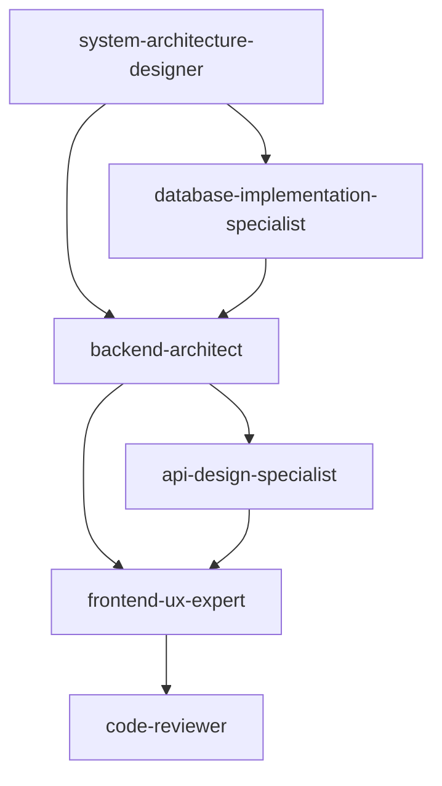
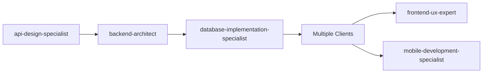
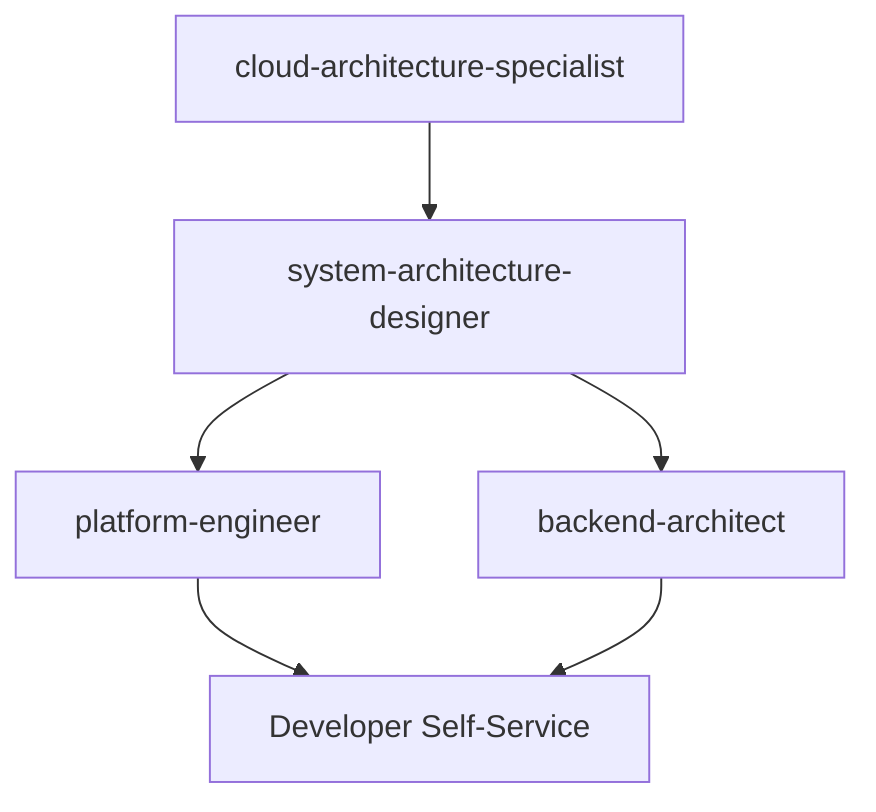

# Core Technical Foundation Agents

Essential building blocks for any technical project, providing fundamental architecture, backend, database, and frontend expertise.

## Overview

The Core Technical Foundation category contains **13 specialist agents** that form the backbone of most software projects. These agents handle everything from high-level system architecture to specific technical implementations across backend, frontend, database, cloud, and API domains.

This category is typically **engaged after strategic planning** and provides the core technical expertise needed to build robust, scalable applications. Whether you're building a simple website or a complex distributed system, these agents deliver professional-grade technical solutions.

**Agent Count**: 13 technical specialists
**Typical Project Phase**: Architecture & Implementation (Weeks 1-6 for most projects)
**Dependencies**: Usually follows coordination agents (strategic planning)
**Enables**: All feature development, data processing, user experience work

---

## Agents in This Category

### Architecture & Design Tier

#### system-architecture-designer
**Use When**: Starting new projects, major refactoring, technology stack selection, scalability planning
**Delivers**: System architecture diagrams, technology recommendations, scalability plans, cost estimates
**Integrates With**: All technical agents (provides foundation), cloud-architecture-specialist
**Typical Timeline**: 1-3 days for architecture design

#### cloud-architecture-specialist
**Use When**: AWS/Azure/GCP deployment, cloud-native architecture, serverless design, multi-region setup
**Delivers**: Cloud architecture, infrastructure-as-code, cost optimization, disaster recovery plans
**Integrates With**: system-architecture-designer, devops-infrastructure-specialist
**Typical Timeline**: 2-4 days for cloud architecture

### Backend Development Tier

#### backend-architect
**Use When**: Server-side architecture, API design, microservices, business logic implementation
**Delivers**: API specifications, backend code, integration patterns, scalability solutions
**Integrates With**: database-implementation-specialist, api-design-specialist
**Typical Timeline**: 1-2 weeks for backend implementation

#### database-implementation-specialist
**Use When**: Database design, schema optimization, query performance, data migration
**Delivers**: Database schemas, migrations, optimization strategies, backup plans
**Integrates With**: backend-architect, data-engineering-specialist
**Typical Timeline**: 3-5 days for database setup

#### api-design-specialist
**Use When**: REST/GraphQL/gRPC API design, versioning strategies, API documentation
**Delivers**: OpenAPI specs, API documentation, versioning strategy, rate limiting
**Integrates With**: backend-architect, frontend-ux-expert
**Typical Timeline**: 2-4 days for API design

### Frontend Development Tier

#### frontend-ux-expert
**Use When**: User interface implementation, React/Vue/Angular, responsive design, web performance
**Delivers**: Frontend application, responsive layouts, performance optimization, accessibility
**Integrates With**: ui-ux-designer, backend-architect (APIs)
**Typical Timeline**: 1-3 weeks for frontend implementation

#### mobile-development-specialist
**Use When**: iOS/Android apps, React Native, Flutter, mobile-specific features
**Delivers**: Native or cross-platform mobile apps, app store deployment
**Integrates With**: backend-architect (APIs), ui-ux-designer
**Typical Timeline**: 2-4 weeks for mobile app

### Quality & Developer Experience Tier

#### code-reviewer
**Use When**: Code quality assurance, best practices enforcement, technical debt assessment
**Delivers**: Code review reports, refactoring recommendations, quality metrics
**Integrates With**: All technical agents (reviews their output)
**Typical Timeline**: Ongoing throughout development

#### developer-experience-engineer
**Use When**: Developer tooling, workflow optimization, CI/CD setup, documentation
**Delivers**: Developer tools, automation scripts, improved workflows
**Integrates With**: devops-infrastructure-specialist, platform-engineer
**Typical Timeline**: 1-2 weeks for DX improvements

#### platform-engineer
**Use When**: Internal developer platforms, golden paths, self-service infrastructure
**Delivers**: Platform abstractions, developer portals, infrastructure automation
**Integrates With**: cloud-architecture-specialist, devops-infrastructure-specialist
**Typical Timeline**: 2-4 weeks for platform setup

### Full-Stack & Specialized Tier

#### fullstack-dev-expert
**Use When**: End-to-end feature development, rapid prototyping, full ownership projects
**Delivers**: Complete features (backend + frontend), prototypes, MVPs
**Integrates With**: Can work independently or with other specialists
**Typical Timeline**: 1-3 weeks per feature

#### prompt-engineer
**Use When**: LLM integration, AI features, prompt optimization, RAG systems
**Delivers**: Optimized prompts, LLM integrations, AI workflows
**Integrates With**: ai-ml-specialist, backend-architect
**Typical Timeline**: 3-7 days for LLM integration

---

## When to Use This Category

### Scenario 1: New Web Application from Scratch
**Sequence**: `@system-architecture-designer → @database-implementation-specialist → @backend-architect → @frontend-ux-expert → @code-reviewer`
**Timeline**: 4-8 weeks
**Outcome**: Production-ready web application

**Step-by-Step**:
1. **@system-architecture-designer**: Designs overall architecture (microservices vs monolith, tech stack)
2. **@database-implementation-specialist**: Creates database schema and optimization
3. **@backend-architect**: Implements APIs and business logic
4. **@frontend-ux-expert**: Builds user interface
5. **@code-reviewer**: Reviews code quality and suggests improvements

**Example**:
```
Project: SaaS project management application

Phase 1: Architecture (3 days)
@system-architecture-designer:
- Node.js microservices architecture
- PostgreSQL for data, Redis for caching
- React frontend, Next.js for SSR
- AWS deployment

Phase 2: Database (4 days)
@database-implementation-specialist:
- Users, projects, tasks, comments tables
- Optimized indexes for queries
- Migration scripts

Phase 3: Backend (2 weeks)
@backend-architect:
- Authentication service (JWT)
- Project management APIs
- Real-time WebSocket for updates
- Background job processing

Phase 4: Frontend (2 weeks)
@frontend-ux-expert:
- React components with TypeScript
- Responsive dashboard
- Real-time updates
- Accessibility compliant

Phase 5: Quality (3 days)
@code-reviewer:
- Code quality assessment
- Security review
- Performance optimization recommendations

Result: Production-ready SaaS app in 6 weeks
```

### Scenario 2: API-First Development
**Sequence**: `@api-design-specialist → @backend-architect → @database-implementation-specialist`
**Timeline**: 2-4 weeks
**Outcome**: Well-designed API ready for multiple clients

**Example**:
```
Project: API for mobile and web clients

@api-design-specialist: OpenAPI specification with versioning
@backend-architect: Implements API with rate limiting and auth
@database-implementation-specialist: Optimizes for API query patterns

Result: Robust API serving web, iOS, and Android clients
```

### Scenario 3: Mobile App with Backend
**Sequence**: `@system-architecture-designer → @backend-architect → @mobile-development-specialist`
**Timeline**: 4-6 weeks
**Outcome**: Native mobile app with cloud backend

### Scenario 4: Cloud-Native Microservices
**Sequence**: `@cloud-architecture-specialist → @system-architecture-designer → @backend-architect → @platform-engineer`
**Timeline**: 6-12 weeks
**Outcome**: Scalable cloud-native architecture

---

## Usage Patterns

### Pattern 1: Traditional Full-Stack Flow



**Best For**: Web applications, SaaS platforms
**Timeline**: 4-8 weeks for MVP

### Pattern 2: API-First Development



**Best For**: Multi-platform applications
**Timeline**: 6-10 weeks

### Pattern 3: Cloud-Native Architecture



**Best For**: Enterprise systems, scalable platforms
**Timeline**: 8-16 weeks

---

## Integration with Other Categories

### Downstream (Categories that need our output)
- **Data & Intelligence**: Needs backend APIs and database schemas
- **Security & Operations**: Needs architecture for security implementation
- **User Experience**: Needs API contracts and backend services

### Upstream (Categories we need input from)
- **Coordination**: Strategic plans and project requirements
- **Business & Marketing**: Business requirements and user needs

### Parallel Opportunities
Can work simultaneously with:
- **User Experience** (design while we build backend)
- **Security & Operations** (security planning while we implement)
- **Data & Intelligence** (data modeling in parallel with architecture)

---

## Success Criteria

### Architecture Deliverables
- [ ] System architecture diagram with all components
- [ ] Technology stack selected with rationale
- [ ] Scalability plan for expected growth
- [ ] Cost estimates for infrastructure
- [ ] Performance targets defined

### Implementation Deliverables
- [ ] Working backend APIs with documentation
- [ ] Database schema implemented and tested
- [ ] Frontend application with core features
- [ ] Code quality meets review standards
- [ ] Integration tests passing

### Quality Gates
- [ ] Architecture reviewed and approved
- [ ] Code passes code-reviewer assessment
- [ ] Performance meets defined benchmarks
- [ ] Security considerations addressed
- [ ] Documentation complete and accessible

---

## Common Issues & Solutions

### Issue 1: Architecture Changes Mid-Project
**Symptom**: Requirements change requiring architectural modifications

**Solution**:
1. Pause implementation and consult @system-architecture-designer
2. Assess impact on existing work
3. Create migration plan with backward compatibility
4. Update all affected agents with new architecture

### Issue 2: Frontend-Backend Integration Conflicts
**Symptom**: API contracts don't match frontend needs

**Solution**:
1. Bring @api-design-specialist and @frontend-ux-expert together
2. Review API specifications and frontend requirements
3. Modify API with versioning to support both old and new
4. Update OpenAPI specs and frontend integration

### Issue 3: Performance Bottlenecks
**Symptom**: Application slow under load

**Solution**:
1. Consult @backend-architect for API optimization
2. Engage @database-implementation-specialist for query optimization
3. Consider @cloud-architecture-specialist for infrastructure scaling
4. Profile and benchmark before and after changes

### Issue 4: Code Quality Degradation
**Symptom**: Technical debt accumulating, bugs increasing

**Solution**:
1. Schedule @code-reviewer for comprehensive review
2. Implement recommended refactoring in phases
3. Establish code quality gates for new code
4. Set up automated linting and testing

---

## Best Practices

1. **Always Start with Architecture**: Don't skip @system-architecture-designer, even for "simple" projects

2. **Define APIs Early**: Engage @api-design-specialist before implementation begins

3. **Parallel Development**: Frontend and backend can proceed in parallel with clear API contracts

4. **Regular Code Reviews**: Use @code-reviewer throughout development, not just at the end

5. **Mobile-First Thinking**: Consider @mobile-development-specialist early if mobile is in scope

6. **Cloud Planning**: Involve @cloud-architecture-specialist in architecture phase, not just deployment

7. **Documentation**: Every agent should create documentation alongside code

---

## Quick Reference

### Agent Selection by Need

| Your Need | Primary Agent | Supporting Agents |
|-----------|---------------|-------------------|
| System design | @system-architecture-designer | @cloud-architecture-specialist |
| Build API | @backend-architect | @api-design-specialist, @database-implementation-specialist |
| Create UI | @frontend-ux-expert | @ui-ux-designer |
| Mobile app | @mobile-development-specialist | @backend-architect |
| Code quality | @code-reviewer | All technical agents |
| Full feature | @fullstack-dev-expert | Can work independently |
| AI integration | @prompt-engineer | @ai-ml-specialist |

### Typical Timeline by Project Size
- **Small (Landing page, portfolio)**: 1-2 weeks, 2-3 agents
- **Medium (SaaS MVP, mobile app)**: 4-8 weeks, 4-6 agents
- **Large (Enterprise platform)**: 3-6 months, 8-12 agents

---

## Examples

### Example 1: E-Commerce Platform
**Agents**: 6 from this category
**Timeline**: 8 weeks

```
Week 1-2: Architecture & Database
- @system-architecture-designer: Microservices architecture
- @database-implementation-specialist: Product catalog, orders, users

Week 3-4: Backend APIs
- @backend-architect: Product, cart, checkout, payment APIs
- @api-design-specialist: REST API with versioning

Week 5-7: Frontend
- @frontend-ux-expert: Product browsing, cart, checkout flow

Week 8: Quality
- @code-reviewer: Security review, performance optimization

Result: Production-ready e-commerce processing orders
```

### Example 2: Mobile-First Startup
**Agents**: 4 from this category
**Timeline**: 6 weeks

```
Week 1: Architecture
- @system-architecture-designer: API-first architecture
- @cloud-architecture-specialist: Serverless on AWS

Week 2-3: Backend
- @backend-architect: User auth, core APIs
- @database-implementation-specialist: DynamoDB schema

Week 4-6: Mobile
- @mobile-development-specialist: React Native app

Result: iOS and Android apps with cloud backend
```

---

*For coordination patterns, see [`../coordination/README.md`](../coordination/README.md)*
*For deployment, see [`../security-operations/README.md`](../security-operations/README.md)*
