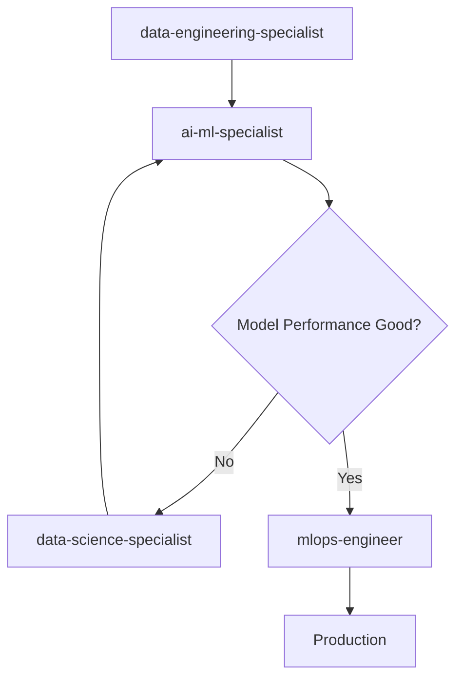
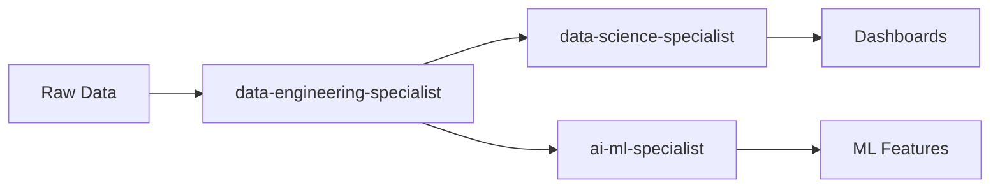
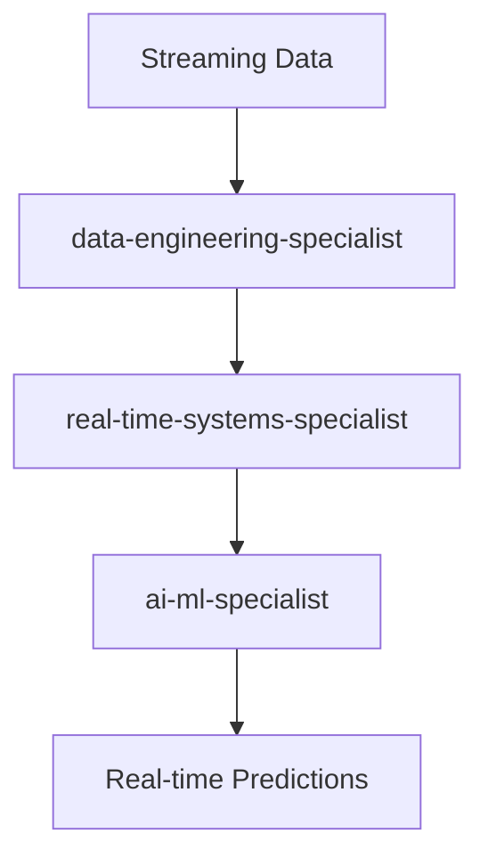

# Data & Intelligence Systems Agents

Specialists who transform data into intelligent features through processing pipelines, AI/ML models, analytics, and performance optimization.

## Overview

The Data & Intelligence Systems category contains **7 specialist agents** that handle all aspects of data-driven applications - from raw data processing to machine learning model implementation, business intelligence, and real-time system optimization.

These agents are essential for **AI-powered applications, data analytics platforms, and intelligent features**. Whether you're building recommendation engines, predictive analytics, or real-time data processing systems, these agents bring the expertise to turn data into business value.

**Agent Count**: 7 data & AI specialists
**Typical Project Phase**: Data & Intelligence Implementation (Weeks 2-6)
**Dependencies**: Often needs backend APIs and database schemas from core-technical
**Enables**: AI-powered features, analytics, intelligent automation

---

## Agents in This Category

### Data Engineering Tier

#### data-engineering-specialist
**Use When**: Data pipeline design, ETL/ELT, data lakes, streaming data, data quality
**Delivers**: Data pipelines, transformation logic, data quality frameworks
**Integrates With**: database-implementation-specialist, ai-ml-specialist
**Typical Timeline**: 1-2 weeks for pipeline setup

**Key Capabilities**:
- Apache Spark, Apache Kafka, Apache Airflow
- AWS Glue, Azure Data Factory, Google Dataflow
- Data lake and lakehouse architectures
- Real-time streaming pipelines
- Data quality and governance

#### integration-specialist
**Use When**: System integration, API connectivity, data synchronization, middleware
**Delivers**: Integration patterns, middleware configurations, sync mechanisms
**Integrates With**: backend-architect, data-engineering-specialist
**Typical Timeline**: 1-2 weeks for integrations

### AI & Machine Learning Tier

#### ai-ml-specialist
**Use When**: ML models, NLP, recommendation engines, semantic search, LLM features
**Delivers**: Trained models, ML pipelines, model APIs, performance metrics
**Integrates With**: data-engineering-specialist, mlops-engineer
**Typical Timeline**: 2-4 weeks for model development

**Key Capabilities**:
- Natural language processing (NLP)
- Recommendation systems
- Computer vision
- Time series forecasting
- LLM integration and fine-tuning

#### mlops-engineer
**Use When**: Model deployment, monitoring, versioning, A/B testing, production ML
**Delivers**: Model serving infrastructure, monitoring dashboards, CI/CD for ML
**Integrates With**: ai-ml-specialist, devops-infrastructure-specialist
**Typical Timeline**: 1-2 weeks for MLOps setup

### Analytics & Optimization Tier

#### data-science-specialist
**Use When**: Business intelligence, statistical analysis, data visualization, insights
**Delivers**: Dashboards, reports, statistical analysis, business insights
**Integrates With**: data-engineering-specialist, business-analyst
**Typical Timeline**: 1-2 weeks for analytics setup

#### real-time-systems-specialist
**Use When**: Performance optimization, concurrent processing, low-latency systems
**Delivers**: Optimized code, caching strategies, performance improvements
**Integrates With**: backend-architect, data-engineering-specialist
**Typical Timeline**: 1-2 weeks for optimization

### Governance Tier

#### ai-ethics-governance-specialist
**Use When**: Responsible AI, bias detection, compliance, ethical AI frameworks
**Delivers**: Ethics frameworks, bias reports, compliance documentation
**Integrates With**: ai-ml-specialist, legal-compliance-specialist
**Typical Timeline**: 1 week for governance setup

---

## When to Use This Category

### Scenario 1: AI-Powered Application
**Sequence**: `@data-engineering-specialist → @ai-ml-specialist → @mlops-engineer`
**Timeline**: 4-6 weeks
**Outcome**: Production ML model serving predictions

**Example**:
```
Project: Product recommendation engine for e-commerce

Week 1-2: Data Pipeline
@data-engineering-specialist:
- Ingest user behavior data
- Product catalog pipeline
- User profile aggregation
- Real-time event streaming

Week 3-4: Model Development
@ai-ml-specialist:
- Collaborative filtering model
- Content-based recommendations
- Hybrid recommendation system
- A/B testing framework

Week 5-6: Production Deployment
@mlops-engineer:
- Model serving API
- Monitoring and alerting
- Auto-scaling infrastructure
- Model versioning

Result: Recommendation engine increasing sales by 25%
```

### Scenario 2: Business Intelligence Platform
**Sequence**: `@data-engineering-specialist → @data-science-specialist`
**Timeline**: 2-3 weeks
**Outcome**: Interactive dashboards with business insights

### Scenario 3: Real-Time Analytics
**Sequence**: `@data-engineering-specialist → @real-time-systems-specialist → @data-science-specialist`
**Timeline**: 3-4 weeks
**Outcome**: Real-time analytics with millisecond latency

### Scenario 4: NLP-Powered Search
**Sequence**: `@data-engineering-specialist → @ai-ml-specialist → @integration-specialist`
**Timeline**: 3-5 weeks
**Outcome**: Semantic search with natural language understanding

---

## Usage Patterns

### Pattern 1: ML Model Development & Deployment



**Best For**: Recommendation systems, predictive models, NLP features
**Timeline**: 4-8 weeks

### Pattern 2: Data Pipeline to Analytics



**Best For**: Business intelligence, operational analytics
**Timeline**: 2-4 weeks

### Pattern 3: Real-Time Intelligence



**Best For**: Fraud detection, real-time personalization
**Timeline**: 4-6 weeks

---

## Integration with Other Categories

### Upstream Dependencies
- **Core Technical**: Backend APIs for data ingestion, database schemas
- **Coordination**: Strategic planning for data strategy

### Downstream Beneficiaries
- **User Experience**: Uses ML features for personalization
- **Business & Marketing**: Uses analytics for insights
- **Security & Operations**: Uses monitoring data for observability

### Common Integration Points
- Data pipelines connect to backend APIs
- ML models serve through backend services
- Analytics dashboards integrate with frontend
- Real-time systems optimize backend performance

---

## Success Criteria

### Data Engineering
- [ ] Data pipelines running reliably
- [ ] Data quality metrics established
- [ ] Real-time and batch processing working
- [ ] Data governance implemented
- [ ] Monitoring and alerting configured

### AI/ML Models
- [ ] Model accuracy meets targets
- [ ] Inference latency acceptable
- [ ] A/B testing framework operational
- [ ] Model monitoring in place
- [ ] Bias and fairness assessed

### Analytics & BI
- [ ] Dashboards providing actionable insights
- [ ] Reports automated and timely
- [ ] Stakeholders trained on tools
- [ ] Data-driven decisions enabled

---

## Common Issues & Solutions

### Issue 1: Poor Model Performance
**Symptom**: ML model not accurate enough

**Solution**:
1. **@data-science-specialist**: Analyze data quality and feature importance
2. **@data-engineering-specialist**: Improve data pipeline and features
3. **@ai-ml-specialist**: Try different models or ensemble methods
4. Iterate until performance targets met

### Issue 2: Data Pipeline Failures
**Symptom**: Pipeline breaking, data inconsistencies

**Solution**:
1. **@data-engineering-specialist**: Add data validation and quality checks
2. Implement retry logic and error handling
3. Set up monitoring and alerting
4. Add data lineage tracking

### Issue 3: Model Serving Latency
**Symptom**: ML predictions too slow

**Solution**:
1. **@mlops-engineer**: Optimize model serving infrastructure
2. **@real-time-systems-specialist**: Add caching and optimization
3. **@ai-ml-specialist**: Model compression or distillation
4. Profile and benchmark improvements

### Issue 4: Bias in AI Models
**Symptom**: Model shows unfair bias

**Solution**:
1. **@ai-ethics-governance-specialist**: Conduct bias audit
2. **@data-science-specialist**: Analyze training data for bias
3. **@ai-ml-specialist**: Implement bias mitigation techniques
4. Establish ongoing monitoring for fairness

---

## Best Practices

1. **Data Quality First**: Clean, validated data is foundation of good AI

2. **Start Simple**: Build simple models first, add complexity as needed

3. **Monitor Everything**: Data quality, model performance, system health

4. **Version Control**: Track data, models, and pipelines

5. **Ethics & Bias**: Consider fairness and ethics from the start

6. **Real-Time When Needed**: Batch processing often sufficient, real-time adds complexity

7. **MLOps from Day 1**: Set up deployment and monitoring infrastructure early

---

## Quick Reference

### Agent Selection by Need

| Your Need | Primary Agent | Supporting Agents |
|-----------|---------------|-------------------|
| Data pipeline | @data-engineering-specialist | @integration-specialist |
| ML model | @ai-ml-specialist | @data-engineering-specialist, @mlops-engineer |
| Deploy model | @mlops-engineer | @devops-infrastructure-specialist |
| Analytics/BI | @data-science-specialist | @data-engineering-specialist |
| Optimization | @real-time-systems-specialist | @backend-architect |
| NLP/LLM | @ai-ml-specialist | @prompt-engineer |
| AI ethics | @ai-ethics-governance-specialist | @ai-ml-specialist |

### Typical Timeline by Complexity
- **Simple (Basic analytics)**: 1-2 weeks, 1-2 agents
- **Medium (ML feature)**: 3-5 weeks, 2-3 agents
- **Complex (Full ML platform)**: 2-3 months, 4-6 agents

---

## Examples

### Example 1: Customer Churn Prediction
**Timeline**: 5 weeks

```
Week 1-2: Data Pipeline
@data-engineering-specialist:
- Historical customer data pipeline
- Feature engineering (usage patterns, engagement)
- Training/validation data splits

Week 3-4: Model Development
@ai-ml-specialist:
- Train classification models (Random Forest, XGBoost)
- Feature importance analysis
- Model evaluation and tuning
- Churn probability API

Week 5: Production & Monitoring
@mlops-engineer:
- Deploy model to production
- Set up monitoring dashboards
- A/B testing framework

Result: 75% accuracy in predicting churn, enabling proactive retention
```

### Example 2: Real-Time Fraud Detection
**Timeline**: 6 weeks

```
Week 1-2: Streaming Pipeline
@data-engineering-specialist:
- Kafka streaming data ingestion
- Real-time feature computation
- Event processing pipeline

Week 3-4: ML Model
@ai-ml-specialist:
- Anomaly detection model
- Transaction risk scoring
- Low-latency inference

Week 5: Optimization
@real-time-systems-specialist:
- Cache frequently accessed data
- Optimize inference latency (<50ms)

Week 6: Governance
@ai-ethics-governance-specialist:
- Bias audit for fairness
- Explainability for fraud decisions

Result: Real-time fraud detection with 95% accuracy, <50ms latency
```

---

*For data storage, see [`../core-technical/README.md`](../core-technical/README.md)*
*For deployment, see [`../security-operations/README.md`](../security-operations/README.md)*
