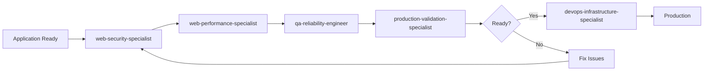
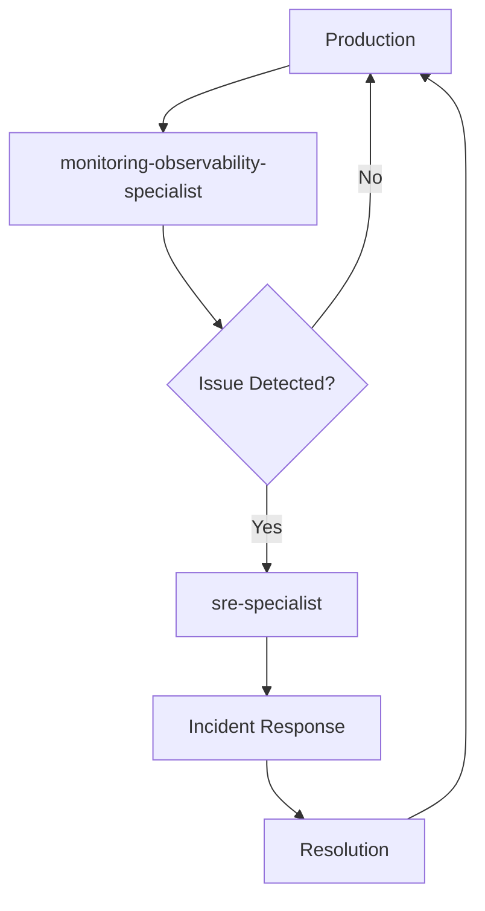
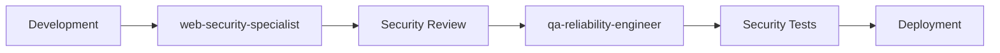

# Security & Operations Agents

Specialists ensuring system reliability, security, performance, and successful production deployment.

## Overview

The Security & Operations category contains **7 specialist agents** that handle the critical aspects of production-ready systems: security implementation, performance optimization, infrastructure deployment, quality assurance, and production validation.

These agents are essential for **enterprise-grade applications and safe production deployments**. They ensure your application is secure, performant, reliable, and ready for real-world traffic.

**Agent Count**: 7 security & operations specialists
**Typical Project Phase**: Security & Production (Throughout + Final weeks)
**Dependencies**: Needs implemented application from core-technical
**Enables**: Safe, secure, and scalable production deployments

---

## Agents in This Category

### Security Tier

#### web-security-specialist
**Use When**: Security implementation, authentication, OWASP compliance, penetration testing
**Delivers**: Security configurations, vulnerability assessments, compliance documentation
**Integrates With**: backend-architect, legal-compliance-specialist
**Typical Timeline**: 1-2 weeks for security implementation

**Key Capabilities**:
- OAuth 2.0, JWT, SAML authentication
- OWASP Top 10 vulnerability mitigation
- Encryption at rest and in transit
- Security headers and CSP
- Penetration testing and security audits

### Performance Tier

#### web-performance-specialist
**Use When**: Performance optimization, Core Web Vitals, caching, CDN setup
**Delivers**: Performance audit, optimization strategies, monitoring setup
**Integrates With**: frontend-ux-expert, backend-architect
**Typical Timeline**: 1 week for optimization

**Key Capabilities**:
- Core Web Vitals optimization (LCP, FID, CLS)
- Caching strategies
- CDN configuration
- Image and asset optimization
- Performance budgets

### Operations & Deployment Tier

#### devops-infrastructure-specialist
**Use When**: Infrastructure deployment, CI/CD, container orchestration, IaC
**Delivers**: Deployment pipelines, infrastructure-as-code, automation scripts
**Integrates With**: cloud-architecture-specialist, sre-specialist
**Typical Timeline**: 1-2 weeks for deployment setup

**Key Capabilities**:
- Kubernetes, Docker, Terraform
- CI/CD pipelines (GitHub Actions, GitLab CI)
- Infrastructure as Code
- Blue-green and canary deployments
- Auto-scaling and load balancing

#### sre-specialist
**Use When**: Site reliability, incident response, disaster recovery, on-call processes
**Delivers**: SLO/SLA definitions, runbooks, incident response procedures
**Integrates With**: devops-infrastructure-specialist, monitoring-observability-specialist
**Typical Timeline**: 1-2 weeks for SRE setup

#### monitoring-observability-specialist
**Use When**: Monitoring, logging, tracing, alerting, observability
**Delivers**: Monitoring dashboards, alerting rules, logging infrastructure
**Integrates With**: sre-specialist, devops-infrastructure-specialist
**Typical Timeline**: 1 week for monitoring setup

**Key Capabilities**:
- Prometheus, Grafana, DataDog, New Relic
- Distributed tracing (Jaeger, Zipkin)
- Log aggregation (ELK, Splunk)
- APM and RUM
- SLO/SLA monitoring

### Quality Assurance Tier

#### qa-reliability-engineer
**Use When**: Testing strategy, test automation, quality gates, regression testing
**Delivers**: Test plans, automated tests, quality metrics
**Integrates With**: All development agents for testing
**Typical Timeline**: Ongoing throughout development

**Key Capabilities**:
- Unit, integration, e2e testing
- Test automation frameworks
- Load and stress testing
- Quality gates and metrics
- Continuous testing in CI/CD

#### production-validation-specialist
**Use When**: Pre-deployment validation, production readiness, smoke testing
**Delivers**: Production readiness checklists, validation reports, go/no-go decisions
**Integrates With**: qa-reliability-engineer, devops-infrastructure-specialist
**Typical Timeline**: 2-3 days before each deployment

---

## When to Use This Category

### Scenario 1: Preparing for Production Launch
**Sequence**: `@web-security-specialist → @web-performance-specialist → @qa-reliability-engineer → @production-validation-specialist → @devops-infrastructure-specialist`
**Timeline**: 2-3 weeks
**Outcome**: Secure, performant application ready for production

**Example**:
```
Project: SaaS application going to production

Week 1: Security & Performance
@web-security-specialist:
- OAuth 2.0 authentication
- SQL injection prevention
- XSS protection
- Security headers
- SSL/TLS configuration

@web-performance-specialist:
- Image optimization
- CDN setup
- Caching strategy
- Core Web Vitals tuning

Week 2: Testing & Validation
@qa-reliability-engineer:
- E2E test suite
- Load testing (1000 concurrent users)
- Security regression tests

@production-validation-specialist:
- Production readiness checklist
- Smoke tests
- Go-live decision

Week 3: Deployment
@devops-infrastructure-specialist:
- CI/CD pipeline
- Kubernetes deployment
- Auto-scaling configuration
- Blue-green deployment

@monitoring-observability-specialist:
- Monitoring dashboards
- Alerting rules
- Log aggregation

Result: Safe production launch with zero downtime
```

### Scenario 2: Ongoing Operations
**Sequence**: `@monitoring-observability-specialist ↔ @sre-specialist`
**Timeline**: Continuous
**Outcome**: Reliable system with proactive incident management

### Scenario 3: Security Audit
**Sequence**: `@web-security-specialist → @production-validation-specialist`
**Timeline**: 1 week
**Outcome**: Security vulnerabilities identified and mitigated

### Scenario 4: Performance Optimization
**Sequence**: `@web-performance-specialist → @monitoring-observability-specialist`
**Timeline**: 1-2 weeks
**Outcome**: Improved performance metrics

---

## Usage Patterns

### Pattern 1: Production Readiness Pipeline



**Best For**: Pre-launch preparation
**Timeline**: 2-3 weeks

### Pattern 2: Continuous Operations



**Best For**: Ongoing operations
**Timeline**: Continuous monitoring

### Pattern 3: Security-First Development



**Best For**: Security-critical applications
**Timeline**: Integrated throughout development

---

## Integration with Other Categories

### Upstream Dependencies
- **Core Technical**: Application to secure and deploy
- **Data & Intelligence**: Systems to monitor and optimize

### Security Integration Points
- Reviews backend code for vulnerabilities
- Validates API security
- Ensures data encryption
- Implements authentication/authorization

### Operations Integration Points
- Deploys applications built by core-technical
- Monitors data pipelines from data-intelligence
- Ensures uptime and reliability

---

## Success Criteria

### Security
- [ ] OWASP Top 10 vulnerabilities addressed
- [ ] Authentication and authorization working
- [ ] Data encrypted at rest and in transit
- [ ] Security headers configured
- [ ] Penetration testing passed

### Performance
- [ ] Core Web Vitals meet targets (LCP < 2.5s, FID < 100ms, CLS < 0.1)
- [ ] Load testing passed for expected traffic
- [ ] Caching and CDN configured
- [ ] Performance monitoring in place

### Operations
- [ ] CI/CD pipeline operational
- [ ] Infrastructure as Code implemented
- [ ] Auto-scaling configured
- [ ] Disaster recovery plan in place
- [ ] Runbooks documented

### Monitoring
- [ ] Application metrics tracked
- [ ] Alerts configured for critical issues
- [ ] Logs centralized and searchable
- [ ] SLOs defined and monitored

### Quality
- [ ] Test coverage >80%
- [ ] All critical paths tested
- [ ] Production validation checklist complete
- [ ] Go-live approval obtained

---

## Common Issues & Solutions

### Issue 1: Security Vulnerabilities Found Pre-Launch
**Symptom**: Penetration test reveals security issues

**Solution**:
1. **@web-security-specialist**: Triage vulnerabilities by severity
2. **@backend-architect**: Fix critical and high severity issues
3. **@qa-reliability-engineer**: Add regression tests
4. **@production-validation-specialist**: Re-validate security
5. Delay launch if critical issues remain

### Issue 2: Performance Degradation in Production
**Symptom**: Slow response times under load

**Solution**:
1. **@monitoring-observability-specialist**: Identify bottlenecks
2. **@web-performance-specialist**: Optimize identified issues
3. **@sre-specialist**: Scale resources if needed
4. **@devops-infrastructure-specialist**: Adjust infrastructure

### Issue 3: Deployment Failures
**Symptom**: Deployments failing or causing downtime

**Solution**:
1. **@devops-infrastructure-specialist**: Review deployment process
2. Implement blue-green or canary deployments
3. Add smoke tests before traffic routing
4. **@sre-specialist**: Create rollback procedures

### Issue 4: Monitoring Gaps
**Symptom**: Issues discovered by users before alerts

**Solution**:
1. **@monitoring-observability-specialist**: Review monitoring coverage
2. Add missing metrics and alerts
3. **@sre-specialist**: Update on-call runbooks
4. Implement synthetic monitoring

---

## Best Practices

1. **Security by Design**: Integrate security from day one, not as afterthought

2. **Shift Left Testing**: Test early and often throughout development

3. **Monitor Everything**: You can't fix what you can't see

4. **Automate Deployments**: Manual deployments are error-prone

5. **Plan for Failure**: Implement circuit breakers, retries, and fallbacks

6. **Document Runbooks**: Clear procedures for incident response

7. **Performance Budgets**: Define and enforce performance targets

---

## Quick Reference

### Agent Selection by Need

| Your Need | Primary Agent | Supporting Agents |
|-----------|---------------|-------------------|
| Security audit | @web-security-specialist | @qa-reliability-engineer |
| Performance | @web-performance-specialist | @monitoring-observability-specialist |
| Deployment | @devops-infrastructure-specialist | @cloud-architecture-specialist |
| Monitoring | @monitoring-observability-specialist | @sre-specialist |
| Testing | @qa-reliability-engineer | @production-validation-specialist |
| Reliability | @sre-specialist | @devops-infrastructure-specialist |
| Go-live | @production-validation-specialist | All security & ops agents |

### Typical Timeline
- **Security hardening**: 1-2 weeks
- **Performance optimization**: 1 week
- **Deployment setup**: 1-2 weeks
- **Monitoring setup**: 1 week
- **Production validation**: 2-3 days

---

## Examples

### Example 1: E-Commerce Launch
**Timeline**: 3 weeks

```
Week 1: Security
@web-security-specialist:
- PCI DSS compliance for payments
- OAuth authentication
- Rate limiting and DDoS protection
- Security headers

Week 2: Performance & Testing
@web-performance-specialist:
- CDN for product images
- Caching for catalog
- Core Web Vitals optimization

@qa-reliability-engineer:
- Load test checkout flow (5000 users)
- Security regression tests
- E2E test automation

Week 3: Deployment
@production-validation-specialist:
- Production readiness review
- Smoke tests on staging

@devops-infrastructure-specialist:
- Blue-green deployment
- Auto-scaling for Black Friday traffic

@monitoring-observability-specialist:
- Payment processing alerts
- Inventory monitoring
- Customer experience metrics

Result: Successful launch handling 10,000 concurrent users
```

### Example 2: SaaS Platform Operations
**Ongoing**

```
@monitoring-observability-specialist:
- 24/7 monitoring dashboards
- SLO tracking (99.9% uptime)
- Performance metrics

@sre-specialist:
- On-call rotations
- Incident response (MTTR < 30 min)
- Post-mortem reviews
- Capacity planning

@devops-infrastructure-specialist:
- Weekly deployments
- Infrastructure updates
- Cost optimization

Result: 99.95% uptime, average MTTR 15 minutes
```

---

*For application development, see [`../core-technical/README.md`](../core-technical/README.md)*
*For AI system monitoring, see [`../data-intelligence/README.md`](../data-intelligence/README.md)*
