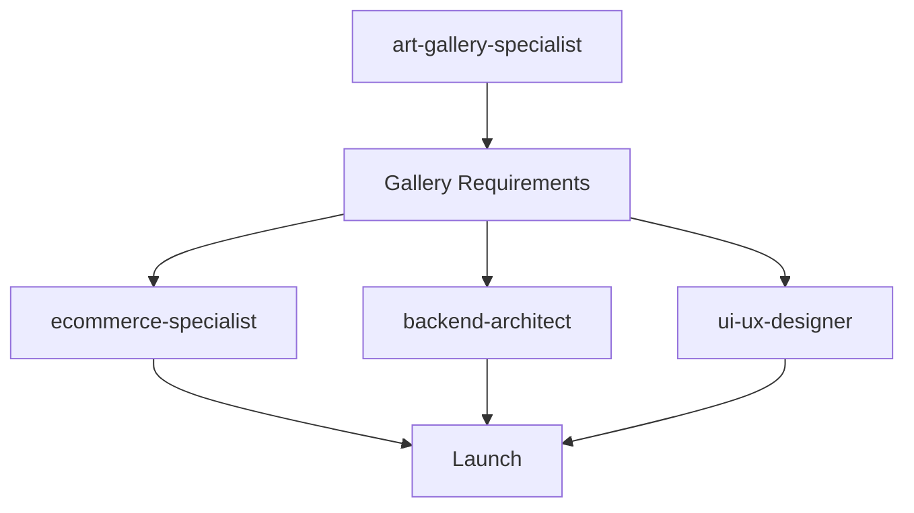
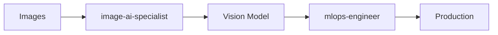
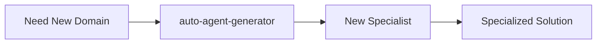

# Specialized Domain Agents

Industry-specific experts providing deep domain knowledge for creative industries, computer vision, and other specialized fields.

## Overview

The Specialized Domains category contains agents with **deep expertise in specific industries or technical domains** that require knowledge beyond general software development. Currently featuring 2 specialists, this category is designed to expand as new domain-specific needs arise.

These agents are essential when your project requires **specialized industry knowledge, vertical-specific workflows, or advanced technical capabilities** in niche areas like art galleries, computer vision, blockchain, healthcare, or other specialized domains.

**Agent Count**: 2 domain specialists (expandable)
**Typical Project Phase**: Integrated throughout domain-specific projects
**Dependencies**: Usually works with core-technical for implementation
**Enables**: Industry-specific features and vertical solutions

---

## Agents in This Category

### Creative Industries

#### art-gallery-specialist
**Use When**: Art gallery websites, artist management, artwork cataloging, provenance tracking
**Delivers**: Gallery management systems, artist portals, artwork databases, sales workflows
**Integrates With**: ecommerce-specialist, content-management-specialist
**Typical Timeline**: 2-4 weeks for gallery platform

**Key Capabilities**:
- **Gallery Operations**: Artist consignment, commission structures, exhibition planning
- **Artwork Management**: Comprehensive metadata, condition reporting, edition tracking
- **Provenance & Authentication**: Ownership history, certificates of authenticity, insurance
- **Art Market Dynamics**: Pricing strategies, auction integration, secondary market
- **Collector Relations**: VIP management, acquisition history, private viewings
- **Art World Integration**: ArtNet, Artsy, gallery association standards

**Unique Knowledge**:
- Gallery business models and revenue streams
- Art world cultural practices and etiquette
- Museum-quality image requirements
- Artist-gallery relationships
- Art fair and exhibition logistics

### Computer Vision & Image Processing

#### image-ai-specialist
**Use When**: Image processing, computer vision, object detection, image classification
**Delivers**: Computer vision models, image processing pipelines, visual recognition systems
**Integrates With**: ai-ml-specialist, data-engineering-specialist
**Typical Timeline**: 3-5 weeks for vision system

**Key Capabilities**:
- **Object Detection**: YOLO, R-CNN, real-time detection
- **Image Classification**: CNN models, transfer learning
- **Semantic Segmentation**: Pixel-level image understanding
- **Image Enhancement**: Super-resolution, denoising, restoration
- **Face Recognition**: Detection, recognition, verification systems
- **OCR & Text**: Document processing, handwriting recognition

**Unique Knowledge**:
- Computer vision architectures
- Image preprocessing techniques
- Model optimization for edge devices
- Real-time video processing
- 3D vision and depth estimation

---

## When to Use This Category

### Scenario 1: Art Gallery Platform
**Sequence**: `@art-gallery-specialist → @ecommerce-specialist → @backend-architect`
**Timeline**: 6-8 weeks
**Outcome**: Complete gallery management and sales platform

**Example**:
```
Project: Contemporary art gallery website with sales

Week 1-2: Gallery Requirements
@art-gallery-specialist:
- Artist consignment workflow design
- Artwork catalog structure (title, medium, dimensions, year, edition)
- Commission calculation system
- Exhibition planning features
- Price inquiry vs public pricing
- Collector CRM requirements

Week 3-4: E-Commerce Integration
@ecommerce-specialist:
- Price-on-request functionality
- Consignment payment split
- Art-specific shipping calculations
- White-glove delivery coordination
- Certificate of authenticity generation

Week 5-6: Implementation
@backend-architect: API and business logic
@database-implementation-specialist: Artwork and artist databases
@frontend-ux-expert: Gallery-style interface

Week 7-8: Polish & Launch
@ui-ux-designer: Museum-quality image display
@web-performance-specialist: Optimize large art images
@seo-marketing-specialist: Art-specific SEO

Result: Professional gallery platform with consignment tracking,
        20% increase in online sales
```

### Scenario 2: Image Recognition System
**Sequence**: `@image-ai-specialist → @ai-ml-specialist → @mlops-engineer`
**Timeline**: 4-6 weeks
**Outcome**: Production computer vision system

**Example**:
```
Project: Product quality inspection system

Week 1-2: Vision Model Development
@image-ai-specialist:
- Defect detection model (YOLOv8)
- Image preprocessing pipeline
- Data augmentation strategy
- Model training on 10,000 images
- 95% accuracy achieved

Week 3-4: Integration
@ai-ml-specialist: ML pipeline optimization
@real-time-systems-specialist: Real-time processing optimization
@backend-architect: API for inspection results

Week 5-6: Deployment
@mlops-engineer: Edge device deployment
@monitoring-observability-specialist: Model performance monitoring

Result: Automated quality inspection, 99.2% accuracy,
        50ms inference time, 70% cost reduction
```

### Scenario 3: Artwork Recognition for Museums
**Sequence**: `@image-ai-specialist → @art-gallery-specialist`
**Timeline**: 3-4 weeks
**Outcome**: Visual artwork identification system

### Scenario 4: Custom Domain Agent Creation
**Use auto-agent-generator** when you need a new specialized domain:
```
@auto-agent-generator: Create blockchain-development-specialist for
smart contracts and DeFi protocols

or

@auto-agent-generator: Create healthcare-compliance-specialist for
HIPAA compliance and medical data systems
```

---

## Usage Patterns

### Pattern 1: Art Gallery Complete Solution



**Best For**: Gallery websites, artist platforms
**Timeline**: 6-10 weeks

### Pattern 2: Computer Vision Pipeline



**Best For**: Image processing, object detection
**Timeline**: 4-6 weeks

### Pattern 3: Expanding Domains



**Best For**: Any new vertical or technical domain
**Timeline**: Variable

---

## Integration with Other Categories

### Art Gallery Integrations
- **Core Technical**: Backend and frontend implementation
- **Business & Marketing**: E-commerce and SEO
- **User Experience**: Gallery-specific UI/UX
- **Security & Operations**: Secure payment and deployment

### Computer Vision Integrations
- **Data & Intelligence**: ML infrastructure and deployment
- **Core Technical**: API and system integration
- **Security & Operations**: Edge deployment and monitoring

---

## Expanding This Category

### When to Add New Domain Specialists

Create new specialized agents when:
- **Industry Expertise Required**: Healthcare, finance, legal, real estate, education
- **Technical Niche**: Blockchain, quantum computing, robotics, IoT
- **Regulatory Domain**: Industry-specific compliance (HIPAA, SOX, etc.)
- **Vertical Solutions**: Manufacturing, logistics, agriculture, energy

### How to Add New Specialists

Use `@auto-agent-generator`:
```
@auto-agent-generator: Create [domain]-specialist agent for [specific expertise]

Examples:
- healthcare-compliance-specialist for HIPAA and medical systems
- blockchain-development-specialist for smart contracts
- real-estate-platform-specialist for property management
- manufacturing-iot-specialist for industrial automation
```

The generator ensures:
- Proper ecosystem integration
- Consistent documentation standards
- Clear role boundaries
- .mdc files under 400 lines

---

## Success Criteria

### Art Gallery Projects
- [ ] Artist and artwork management operational
- [ ] Commission calculations accurate
- [ ] Provenance tracking complete
- [ ] Collector CRM functional
- [ ] Exhibition planning supported
- [ ] Art market standards followed

### Computer Vision Projects
- [ ] Model accuracy meets requirements
- [ ] Inference latency acceptable
- [ ] Edge deployment working (if needed)
- [ ] Model monitoring in place
- [ ] False positive rate acceptable

### Domain Expansion
- [ ] New agent follows ecosystem standards
- [ ] Clear non-overlapping specialization
- [ ] Proper category placement
- [ ] Integration with existing agents documented

---

## Common Issues & Solutions

### Issue 1: Art Gallery Pricing Complexity
**Symptom**: Complex commission and pricing rules

**Solution**:
1. **@art-gallery-specialist**: Document all pricing scenarios
2. **@ecommerce-specialist**: Implement flexible pricing engine
3. **@backend-architect**: Build rule-based calculation system
4. Test with real gallery scenarios

### Issue 2: Computer Vision Accuracy
**Symptom**: Model not accurate enough for production

**Solution**:
1. **@image-ai-specialist**: Analyze failure cases
2. Collect more training data for problem cases
3. Try ensemble methods or different architectures
4. **@data-science-specialist**: Statistical analysis of errors
5. Iterate until accuracy target met

### Issue 3: Missing Domain Expertise
**Symptom**: No agent covers your specific domain

**Solution**:
1. Use **@auto-agent-generator** to create new specialist
2. Provide clear domain requirements and expertise areas
3. New agent ready in 10-20 minutes
4. Integrate with project workflow

---

## Best Practices

1. **Understand Domain Deeply**: Domain specialists need real expertise, not superficial knowledge

2. **Industry Standards**: Follow established industry practices and standards

3. **Cultural Sensitivity**: Respect industry culture and etiquette (especially art world)

4. **Vertical Integration**: Connect domain knowledge with technical implementation

5. **Expand as Needed**: Add new specialists when gaps identified

6. **Real-World Validation**: Test with domain experts and practitioners

---

## Quick Reference

### Current Specialists

| Domain | Agent | When to Use |
|--------|-------|-------------|
| Art Galleries | @art-gallery-specialist | Gallery websites, artist management, art sales |
| Computer Vision | @image-ai-specialist | Image processing, object detection, visual AI |

### Creating New Specialists

| Need | Action |
|------|--------|
| New domain required | @auto-agent-generator |
| Expand existing specialist | Enhance existing agent |
| Temporary specialization | Consult existing agents |

### Typical Timeline
- **Art gallery platform**: 6-10 weeks
- **Computer vision system**: 4-6 weeks
- **New specialist creation**: 10-20 minutes
- **Domain integration**: 1-2 weeks

---

## Examples

### Example 1: High-End Art Gallery Website
**Timeline**: 8 weeks

```
@art-gallery-specialist + Multiple agents:

Week 1-2: Gallery Operations
- Artist roster (50 artists)
- Artwork catalog (2000 pieces)
- Consignment tracking
- Commission calculation (varies by artist 30-50%)
- Exhibition planning for 6 annual shows

Week 3-4: Collector Experience
- Private viewing scheduler
- Acquisition history tracking
- Price-on-request system
- VIP collector tiers
- Personalized recommendations

Week 5-6: Sales & Commerce
- Inquiry-to-sale workflow
- Payment processing (wire, check, crypto)
- White-glove shipping coordination
- Certificate of authenticity generation
- Consignment payment splits

Week 7-8: Polish & Launch
- Museum-quality image display
- Artist biography pages
- Exhibition archives with catalogs
- Press and media gallery
- Art world SEO optimization

Result: Professional gallery presence, online inquiry volume
        increased 300%, 15% of inquiries converting to sales
```

### Example 2: Industrial Quality Control
**Timeline**: 5 weeks

```
@image-ai-specialist + ML team:

Week 1-2: Model Development
- YOLOv8 for defect detection
- 8 defect categories
- Training on 15,000 images
- Data augmentation
- 97% accuracy achieved

Week 3: Optimization
- Model quantization for edge deployment
- TensorRT optimization
- Real-time processing (30 FPS)
- Inference time: 33ms

Week 4: Integration
- Edge device deployment (NVIDIA Jetson)
- Integration with production line
- Alert system for defects
- Dashboard for QC team

Week 5: Production & Monitoring
- Deployment to 3 production lines
- Performance monitoring
- Continuous model improvement

Result: 99% detection rate, reduced manual inspection by 85%,
        ROI achieved in 4 months
```

---

## Future Expansion Opportunities

This category can grow to include:

- **Healthcare**: Medical imaging, HIPAA compliance, EHR integration
- **Finance**: Trading systems, risk models, regulatory compliance
- **Legal**: Contract analysis, case research, compliance tracking
- **Real Estate**: Property management, MLS integration, valuation models
- **Education**: Learning management, curriculum design, accreditation
- **Manufacturing**: IoT, predictive maintenance, supply chain
- **Agriculture**: Precision farming, crop monitoring, yield prediction
- **Energy**: Smart grids, renewable integration, demand forecasting

**To add any of these, use @auto-agent-generator with specific requirements.**

---

*For agent creation, see [`../coordination/README.md`](../coordination/README.md)*
*For technical implementation, see [`../core-technical/README.md`](../core-technical/README.md)*
