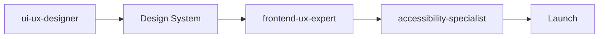
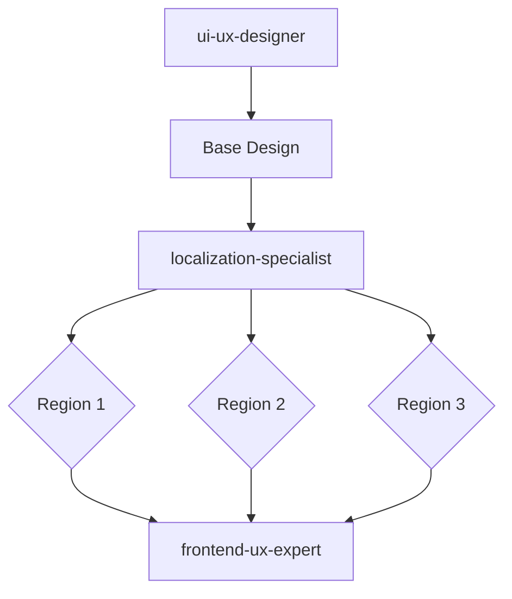
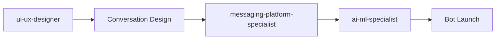

# User Experience & Communication Agents

Specialists focused on creating exceptional user experiences through interface design, messaging platforms, global localization, and content management.

## Overview

The User Experience & Communication category contains **7 specialist agents** that ensure applications provide outstanding user experiences across all touchpoints - from traditional web interfaces to conversational platforms, with proper cultural adaptation and content organization for global audiences.

These agents are essential for **user-facing applications, global products, and content-rich platforms**. They ensure your application is intuitive, accessible, culturally appropriate, and delightful to use.

**Agent Count**: 7 UX & communication specialists
**Typical Project Phase**: Design & UX Implementation (Throughout project)
**Dependencies**: Often works in parallel with core-technical
**Enables**: Superior user experiences and global reach

---

## Agents in This Category

### Design & Interface Tier

#### ui-ux-designer
**Use When**: Interface design, user research, wireframes, design systems, usability testing
**Delivers**: Design mockups, wireframes, prototypes, design systems, user research reports
**Integrates With**: frontend-ux-expert (hands off designs for implementation)
**Typical Timeline**: 1-3 weeks for design phase

**Key Capabilities**:
- User research and personas
- Information architecture
- Wireframing and prototyping
- Visual design and branding
- Usability testing
- Design systems

#### accessibility-specialist
**Use When**: WCAG compliance, screen reader optimization, inclusive design
**Delivers**: Accessibility audits, WCAG compliance reports, remediation plans
**Integrates With**: ui-ux-designer, frontend-ux-expert
**Typical Timeline**: 1 week for accessibility audit

**Key Capabilities**:
- WCAG 2.1 AA/AAA compliance
- Screen reader testing
- Keyboard navigation
- Color contrast optimization
- Cognitive accessibility
- Assistive technology support

### Communication Platforms Tier

#### messaging-platform-specialist
**Use When**: Chat interfaces, conversational UI, messaging integrations, chatbots
**Delivers**: Messaging architecture, chatbot flows, integration specs
**Integrates With**: backend-architect, ai-ml-specialist
**Typical Timeline**: 2-3 weeks for messaging implementation

**Key Capabilities**:
- Slack, Discord, WhatsApp, Telegram integration
- Conversational UI design
- Chatbot development
- Natural language interfaces
- Real-time messaging

#### technical-writing-specialist
**Use When**: API documentation, user guides, help content, knowledge bases
**Delivers**: API docs, user manuals, help articles, documentation sites
**Integrates With**: All technical agents (documents their work)
**Typical Timeline**: 1-2 weeks for documentation

#### developer-relations-engineer
**Use When**: Developer community, API adoption, technical evangelism, developer experience
**Delivers**: Developer portals, API examples, community programs, tutorials
**Integrates With**: technical-writing-specialist, api-design-specialist
**Typical Timeline**: Ongoing for community building

### Global & Content Tier

#### localization-specialist
**Use When**: Internationalization, multi-language support, cultural adaptation
**Delivers**: i18n implementation, translation workflows, cultural guidelines
**Integrates With**: ui-ux-designer, frontend-ux-expert
**Typical Timeline**: 1-2 weeks per language/region

**Key Capabilities**:
- i18n/L10n implementation
- RTL language support
- Cultural adaptation
- Translation management
- Multi-currency handling
- Regional compliance

#### content-management-specialist
**Use When**: CMS implementation, content workflows, editorial processes
**Delivers**: CMS architecture, content models, editorial workflows
**Integrates With**: backend-architect, technical-writing-specialist
**Typical Timeline**: 1-2 weeks for CMS setup

---

## When to Use This Category

### Scenario 1: User-Centered Product Development
**Sequence**: `@ui-ux-designer → @frontend-ux-expert → @accessibility-specialist`
**Timeline**: 3-5 weeks
**Outcome**: Beautiful, accessible user interface

**Example**:
```
Project: SaaS dashboard redesign

Week 1-2: Design
@ui-ux-designer:
- User research (interviews with 15 customers)
- Information architecture
- Wireframes for 8 key screens
- High-fidelity mockups
- Design system components

Week 3-4: Implementation
@frontend-ux-expert:
- React component library
- Responsive layouts
- Animations and micro-interactions
- Performance optimization

Week 5: Accessibility
@accessibility-specialist:
- WCAG 2.1 AA audit
- Screen reader testing
- Keyboard navigation fixes
- Color contrast adjustments

Result: Modern, accessible dashboard with 40% improved user satisfaction
```

### Scenario 2: Global Product Launch
**Sequence**: `@localization-specialist → @ui-ux-designer → @frontend-ux-expert`
**Timeline**: 4-6 weeks
**Outcome**: Product localized for multiple markets

### Scenario 3: Conversational Interface
**Sequence**: `@ui-ux-designer → @messaging-platform-specialist → @ai-ml-specialist`
**Timeline**: 3-4 weeks
**Outcome**: Intelligent chatbot or messaging integration

### Scenario 4: Developer Platform
**Sequence**: `@technical-writing-specialist → @developer-relations-engineer`
**Timeline**: 2-3 weeks
**Outcome**: Developer-friendly API with great documentation

---

## Usage Patterns

### Pattern 1: Design-First Development



**Best For**: User-facing applications, redesigns
**Timeline**: 3-5 weeks

### Pattern 2: Global Product



**Best For**: Multi-region products
**Timeline**: 4-8 weeks

### Pattern 3: Conversational Platform



**Best For**: Chatbots, messaging apps
**Timeline**: 3-4 weeks

---

## Integration with Other Categories

### Works Closely With
- **Core Technical**: Frontend developers implement UX designs
- **Business & Marketing**: Aligns UX with business goals
- **Data & Intelligence**: Uses AI for personalization

### UX Influences
- User research guides product direction
- Design systems ensure consistency
- Accessibility ensures legal compliance
- Localization enables global reach

---

## Success Criteria

### Design
- [ ] User research conducted and documented
- [ ] Wireframes and mockups approved
- [ ] Design system established
- [ ] Usability testing completed
- [ ] Design-dev handoff smooth

### Accessibility
- [ ] WCAG 2.1 AA compliance achieved
- [ ] Screen reader tested
- [ ] Keyboard navigation working
- [ ] Color contrast meets standards
- [ ] Accessibility statement published

### Localization
- [ ] i18n framework implemented
- [ ] Target languages supported
- [ ] Cultural adaptation complete
- [ ] RTL languages working (if applicable)
- [ ] Regional content appropriate

### Content & Documentation
- [ ] Documentation complete and accurate
- [ ] Content workflows established
- [ ] CMS configured and tested
- [ ] Help content accessible
- [ ] Community resources available

---

## Common Issues & Solutions

### Issue 1: Design-Development Gap
**Symptom**: Implemented UI doesn't match designs

**Solution**:
1. **@ui-ux-designer**: Create detailed design specs with measurements
2. **@frontend-ux-expert**: Request clarification before implementing
3. Establish regular design reviews during implementation
4. Use design system with shared component library

### Issue 2: Accessibility Failures
**Symptom**: Accessibility audit finds WCAG violations

**Solution**:
1. **@accessibility-specialist**: Conduct audit and prioritize issues
2. **@frontend-ux-expert**: Fix critical issues first
3. **@ui-ux-designer**: Update design system with accessible patterns
4. Add accessibility testing to CI/CD

### Issue 3: Localization Bugs
**Symptom**: Text overflow, broken layouts in translated versions

**Solution**:
1. **@localization-specialist**: Review problematic languages
2. **@frontend-ux-expert**: Make layouts flexible for variable text length
3. **@ui-ux-designer**: Design with localization in mind
4. Test with longest expected translations

### Issue 4: Poor Documentation Adoption
**Symptom**: Users/developers not using documentation

**Solution**:
1. **@technical-writing-specialist**: Analyze user feedback
2. **@developer-relations-engineer**: Gather developer insights
3. Improve search and navigation
4. Add more examples and tutorials
5. Create video content

---

## Best Practices

1. **User Research First**: Understand users before designing

2. **Design Systems**: Create consistent, reusable components

3. **Accessibility from Start**: Don't retrofit accessibility later

4. **Test with Real Users**: Usability testing reveals issues

5. **Localize Early**: Design with global audience in mind

6. **Document Everything**: Good documentation is part of UX

7. **Iterate Based on Feedback**: Continuous improvement

---

## Quick Reference

### Agent Selection by Need

| Your Need | Primary Agent | Supporting Agents |
|-----------|---------------|-------------------|
| UI/UX design | @ui-ux-designer | @frontend-ux-expert |
| Accessibility | @accessibility-specialist | @ui-ux-designer |
| Chatbot/messaging | @messaging-platform-specialist | @ai-ml-specialist |
| Documentation | @technical-writing-specialist | @developer-relations-engineer |
| Global product | @localization-specialist | @ui-ux-designer |
| Content management | @content-management-specialist | @backend-architect |
| Developer community | @developer-relations-engineer | @technical-writing-specialist |

### Typical Timeline
- **Design phase**: 1-3 weeks
- **Accessibility audit**: 1 week
- **Localization (per language)**: 1-2 weeks
- **Documentation**: 1-2 weeks
- **Messaging integration**: 2-3 weeks

---

## Examples

### Example 1: Mobile App Redesign
**Timeline**: 5 weeks

```
Week 1-2: Research & Design
@ui-ux-designer:
- User interviews (20 participants)
- Competitive analysis
- Information architecture
- Wireframes and prototypes
- High-fidelity mockups

Week 3-4: Implementation
@frontend-ux-expert:
- React Native components
- Animations and gestures
- Dark mode support

Week 5: Accessibility
@accessibility-specialist:
- VoiceOver/TalkBack testing
- Touch target sizes
- Color contrast
- Screen reader announcements

Result: 4.8-star rating, 60% increase in engagement
```

### Example 2: Global E-Commerce Platform
**Timeline**: 8 weeks

```
Week 1-2: Base Design
@ui-ux-designer: Core interface design

Week 3-4: Localization Setup
@localization-specialist:
- i18n framework
- Translation workflow
- Currency handling
- Regional compliance

Week 5-6: Regional Adaptations
Language implementations:
- Spanish (Latin America)
- German
- Japanese
- Arabic (RTL)

Week 7-8: Content & Testing
@content-management-specialist: Regional content
@accessibility-specialist: Multi-language accessibility

Result: Successful launch in 4 markets, 2x international revenue
```

### Example 3: Developer API Platform
**Timeline**: 3 weeks

```
Week 1: Documentation
@technical-writing-specialist:
- API reference documentation
- Getting started guide
- Code examples in 5 languages
- Interactive API explorer

Week 2-3: Developer Relations
@developer-relations-engineer:
- Developer portal
- Sample projects
- Tutorial videos
- Community Discord setup
- Office hours program

Result: 500+ developers onboarded in first month, 95% satisfaction
```

---

*For frontend implementation, see [`../core-technical/README.md`](../core-technical/README.md)*
*For AI-powered UX, see [`../data-intelligence/README.md`](../data-intelligence/README.md)*
