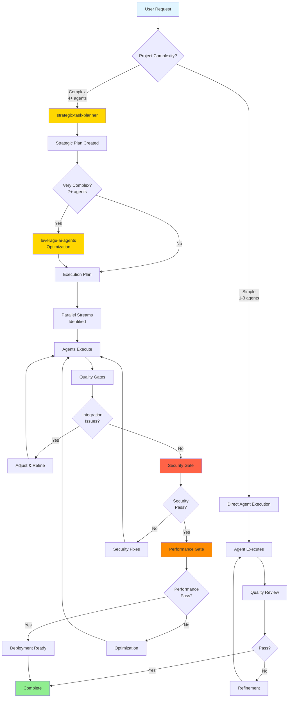

# Agent Coordination Guide

This guide explains how to effectively coordinate multiple AI agents to tackle complex projects that require expertise across multiple domains.

## 📖 **Who Should Use This Guide**

### **Primary Users:**
- **`@strategic-task-planner`** - Reference for coordination patterns and agent selection matrices
- **`@leverage-ai-agents`** - Reference for orchestration methodologies and workflow optimization
- **Project coordinators** - Understanding multi-agent coordination strategies

### **Secondary Users:**
- **All specialist agents** - Understanding their role in coordination workflows
- **Users** - Learning how to effectively coordinate agent teams for complex projects

## 🎯 When to Use Agent Coordination

### **Simple Projects** (1-2 agents)
For straightforward tasks, direct agent engagement works well:
```
@frontend-ux-expert create a responsive navigation component
```

### **Complex Projects** (3+ agents)
For multi-domain challenges, use coordination:
```
@strategic-task-planner: We need to build an e-commerce platform with AI-powered recommendations and global localization
```

## 🔄 Coordination Workflow

### **Step 1: Strategic Planning**
Always start with the strategic task planner:
- **Input**: High-level project description and requirements
- **Output**: Detailed execution plan with agent sequence and dependencies
- **Example**: `@strategic-task-planner: Design a SaaS application for project management`

### **Step 2: Agent Orchestration** (For Complex Projects)
For projects requiring 4+ agents or complex coordination:
- **Input**: Strategic plan from step 1
- **Output**: Optimized agent collaboration workflow
- **Example**: `@leverage-ai-agents: Optimize the execution plan for our SaaS project`

### **Step 3: Sequential Execution**
Execute the plan with proper handoffs:
```
@system-architecture-designer → @database-implementation-specialist →
@backend-architect → @frontend-ux-expert → @web-security-specialist
```

## 📋 Coordination Patterns

### **Sequential Pattern**
**Best for**: Traditional development workflows, dependency-heavy projects
```
Requirements → Architecture → Database → Backend → Frontend → Security → Deploy
```

**Example Flow:**
1. `@strategic-task-planner` - Project planning and breakdown
2. `@system-architecture-designer` - System design and technology stack
3. `@database-implementation-specialist` - Schema design and optimization
4. `@backend-architect` - API design and business logic
5. `@frontend-ux-expert` - User interface and experience
6. `@web-security-specialist` - Security implementation
7. `@devops-infrastructure-specialist` - Deployment and infrastructure

### **Parallel Pattern**
**Best for**: Independent components, time-critical projects
```
Architecture Design
    ├── Database Setup (parallel)
    ├── AI Model Training (parallel)
    └── Frontend Mockups (parallel)
```

**Example Parallel Streams:**
- **Stream A**: `@data-engineering-specialist` → `@ai-ml-specialist`
- **Stream B**: `@database-implementation-specialist` → `@backend-architect`
- **Stream C**: `@ui-ux-designer` → `@frontend-ux-expert`

### **Iterative Pattern**
**Best for**: Research projects, user-centered design, optimization
```
Research → Prototype → Test → Refine → Repeat
```

**Example Iterations:**
1. **Research**: `@documentation-research-specialist`
2. **Prototype**: `@fullstack-dev-expert`
3. **Test**: `@qa-reliability-engineer`
4. **Analyze**: `@data-science-specialist`
5. **Refine**: Return to appropriate specialist

### **Hybrid Pattern**
**Best for**: Enterprise projects, complex systems
```
Sequential foundation + Parallel development + Iterative refinement
```

## 🎪 Agent Selection Matrix

### **By Project Type**

#### **E-commerce Platform**
```
Core Team: strategic-task-planner → system-architecture-designer →
           database-implementation-specialist → backend-architect
Specialists: ecommerce-specialist + web-security-specialist + web-performance-specialist
Enhancement: ai-ml-specialist (recommendations) + seo-marketing-specialist
```

#### **AI/ML Application**
```
Core Team: strategic-task-planner → data-engineering-specialist →
           ai-ml-specialist → real-time-systems-specialist
Specialists: data-science-specialist + web-performance-specialist
Interface: frontend-ux-expert + messaging-platform-specialist (if applicable)
```

#### **Global SaaS Platform**
```
Foundation: strategic-task-planner → system-architecture-designer → database-implementation-specialist
Core Development: backend-architect + frontend-ux-expert + real-time-systems-specialist
Globalization: localization-specialist + messaging-platform-specialist
Operations: devops-infrastructure-specialist + web-security-specialist + qa-reliability-engineer
```

#### **Content Management System**
```
Core: strategic-task-planner → system-architecture-designer → database-implementation-specialist
Content: content-management-specialist + image-ai-specialist (if applicable)
Interface: ui-ux-designer + frontend-ux-expert
Marketing: seo-marketing-specialist + web-performance-specialist
```

### **By Expertise Needed**

#### **Data-Heavy Projects**
- `data-engineering-specialist` - Data pipelines and processing
- `database-implementation-specialist` - Storage optimization
- `data-science-specialist` - Analytics and insights
- `ai-ml-specialist` - Machine learning features

#### **User-Facing Applications**
- `ui-ux-designer` - Design and user research
- `frontend-ux-expert` - Implementation and optimization
- `web-performance-specialist` - Loading and interaction speed
- `localization-specialist` - Global accessibility

#### **Enterprise Systems**
- `web-security-specialist` - Security and compliance
- `devops-infrastructure-specialist` - Scalable deployment
- `qa-reliability-engineer` - Testing and quality assurance
- `production-validation-specialist` - Production readiness

## 🔧 Handoff Best Practices

### **Structured Handoffs**
Each agent should provide:
1. **Context**: What was accomplished and why
2. **Deliverables**: Specific outputs (code, designs, documentation)
3. **Dependencies**: What the next agent needs to know
4. **Validation**: How to verify the work is correct

### **Quality Gates**
Define checkpoints between agents:
- **Design Gate**: Architecture approved before implementation
- **Integration Gate**: Components work together
- **Security Gate**: Security review passed
- **Performance Gate**: Performance requirements met

### **Documentation Standards**
Maintain consistency across agents:
- Decision rationale and trade-offs
- Technical specifications and constraints
- Testing and validation procedures
- Deployment and operational requirements

## 🚀 Advanced Coordination Strategies

### **Risk Mitigation**
- **Parallel Validation**: Have secondary agents review critical decisions
- **Incremental Delivery**: Break large projects into smaller, validated chunks
- **Expertise Overlap**: Use multiple agents for critical components

### **Efficiency Optimization**
- **Agent Reuse**: Same agent for related tasks within a project
- **Batch Operations**: Group similar tasks for single agent sessions
- **Template Patterns**: Reuse successful coordination patterns

### **Quality Assurance**
- **Cross-Domain Review**: Agents review adjacent domains for integration issues
- **End-to-End Testing**: Full system validation with multiple agents
- **Performance Validation**: Real-world testing with appropriate specialists

## 📊 Success Metrics

### **Coordination Effectiveness**
- **Project Completion Rate**: Projects delivered on time and in scope
- **Quality Outcomes**: Defect rates and user satisfaction
- **Agent Utilization**: Efficient use of specialist expertise
- **Handoff Quality**: Smooth transitions between agents

### **Process Optimization**
- **Cycle Time**: Time from project start to completion
- **Rework Rate**: How often work needs to be redone
- **Decision Quality**: Accuracy of technical and business decisions
- **Knowledge Transfer**: How well expertise is shared between agents

Remember: Great coordination turns individual expertise into collective intelligence. The goal is not just to complete tasks, but to create solutions that are greater than the sum of their parts.

---

## 🔧 Troubleshooting Common Coordination Issues

### Issue 1: Too Many Agents Selected (Coordination Overload)

**Symptom**: Project has 10+ agents, becoming difficult to manage and coordinate

**Root Causes**:
- Over-specification: Selecting specialists for every minor task
- No task grouping: Each small task gets a separate agent
- Lack of confidence: "Better safe than sorry" agent selection

**Solution**:
1. Use `@leverage-ai-agents` to optimize agent selection
2. Group related tasks - one agent can often handle multiple tasks
3. Start with core team (3-5 agents), add specialists only when genuinely needed
4. Use consultation protocol for quick expert input vs full persona switches

**Example - Before (Overload)**:
```
15 agents: strategic-task-planner, system-architecture-designer, database-implementation-specialist,
backend-architect, api-design-specialist, frontend-ux-expert, ui-ux-designer, web-security-specialist,
web-performance-specialist, accessibility-specialist, localization-specialist, seo-marketing-specialist,
code-reviewer, qa-reliability-engineer, devops-infrastructure-specialist
```

**Example - After (Optimized)**:
```
6 agents: strategic-task-planner, system-architecture-designer, backend-architect (+ API design),
frontend-ux-expert (+ UI/UX), web-security-specialist (reviews all), devops-infrastructure-specialist
+ Consultations: web-performance-specialist, accessibility-specialist (as needed)
```

### Issue 2: Poor Handoffs Between Agents

**Symptom**: Next agent lacks context, has to ask questions, or rework is required

**Root Causes**:
- Incomplete SHARED_PROGRESS.md updates
- Missing key decisions documentation
- Deliverables not clearly identified
- No explicit "next steps" guidance

**Solution**:
Use the **Structured Handoff Format** (see Handoff Best Practices section):
1. **Context**: What was accomplished and why
2. **Deliverables**: Specific outputs with file paths
3. **Key Decisions**: Important choices made and rationale
4. **Dependencies**: What the next agent needs to know
5. **Validation**: How to verify the work is correct
6. **Next Steps**: Recommended next actions

**Prevention**: Review `WORKSPACE_PROTOCOLS.md` for handoff examples

### Issue 3: Agents Working in Isolation (No Integration)

**Symptom**: Components don't integrate well, conflicting approaches, rework needed

**Root Causes**:
- No upfront architectural coordination
- Agents not consulting each other
- Missing integration points definition
- No quality gates between phases

**Solution**:
1. **Always start with coordination agent** (`strategic-task-planner`)
2. **Define integration points** before parallel work begins
3. **Use quality gates** (Design Gate, Integration Gate, Security Gate, Performance Gate)
4. **Encourage consultations** between agents working on related components
5. **Schedule sync points** for parallel streams to merge and validate

**Example - Integration Points**:
```
Stream A (Backend) → Integration Point: API Contract (OpenAPI spec)
Stream B (Frontend) → Integration Point: API Contract (OpenAPI spec)
Sync Point: Both teams agree on API contract before implementation
```

### Issue 4: Wrong Coordination Pattern Selected

**Symptom**: Project is slower than expected, agents waiting on each other, or missing parallelization opportunities

**Root Causes**:
- Using sequential pattern when parallel would work
- Using parallel pattern without clear independence
- Not recognizing iterative needs
- Misunderstanding project structure

**Solution - Pattern Selection Guide**:

| Characteristic | Best Pattern |
|----------------|--------------|
| Clear dependencies, linear flow | Sequential |
| Independent components | Parallel |
| Research/optimization needed | Iterative |
| Complex enterprise project | Hybrid |
| Tight deadlines, independent work | Parallel |
| Learning/experimentation phase | Iterative |
| Unknown requirements | Iterative → Sequential |

**Decision Tree**:
- Can components be built independently? → Parallel
- Need to learn/research first? → Iterative
- Clear A→B→C dependencies? → Sequential
- Large complex system? → Hybrid (all patterns)

### Issue 5: Coordination Agent Bottleneck

**Symptom**: All communication goes through coordination agent, slowing down progress

**Root Causes**:
- Over-centralized coordination
- Agents not empowered to consult directly
- Misunderstanding of consultation protocol
- Fear of breaking hierarchy

**Solution**:
1. **Empower direct consultations** - agents can consult specialists directly
2. **Coordination agent sets strategy**, then steps back during execution
3. **Use consultation protocol** without coordination agent involvement
4. **Async updates** - agents update SHARED_PROGRESS.md, coordinator reviews periodically

**Good Pattern**:
```
Coordinator: Defines strategy, assigns agents, defines quality gates
↓
Agents: Execute independently, consult specialists directly, update progress
↓
Coordinator: Reviews at quality gates, adjusts if needed
```

### Issue 6: Skipping Coordination for Complex Projects

**Symptom**: 4+ agents selected but no coordination agent used, chaos ensues

**Root Causes**:
- Underestimating complexity
- Trying to save time
- Not recognizing need for orchestration
- Unclear agent sequence

**Solution**:
- **Rule of thumb**: 4+ agents = use coordination agent
- **Start with `@strategic-task-planner`** for any multi-agent project
- **Use `@leverage-ai-agents`** for complex orchestration (7+ agents, parallel streams)
- **Document execution plan** before agents start work

**When to ALWAYS use coordination**:
- ✅ 4+ agents involved
- ✅ Parallel work streams
- ✅ Complex dependencies
- ✅ Enterprise/production projects
- ✅ Unclear requirements or scope

---

## 📊 End-to-End Coordination Workflow



**Key Stages**:
1. **Assessment**: Determine complexity and coordination needs
2. **Planning**: Strategic breakdown and agent selection
3. **Optimization**: For complex projects, optimize workflows
4. **Execution**: Agents work independently or in streams
5. **Quality Gates**: Integration, Security, Performance checkpoints
6. **Refinement**: Address issues found at gates
7. **Completion**: Validated, production-ready deliverables

---

## 🎯 Quick Reference: When to Use What

| Situation | Action | Pattern |
|-----------|--------|---------|
| "Build a simple API" | `@backend-architect` | Direct execution |
| "Build e-commerce platform" | `@strategic-task-planner` | Coordination → Parallel |
| "Optimize existing code" | `@web-performance-specialist` | Direct → Iterative |
| "Enterprise SaaS" | `@strategic-task-planner` → `@leverage-ai-agents` | Hybrid coordination |
| "Research best approach" | `@documentation-research-specialist` | Iterative |
| "Need security review" | `[CONSULT] @web-security-specialist` | Consultation |
| "10+ agents needed" | `@leverage-ai-agents` | Complex orchestration |

---

**Remember**: Effective coordination is about finding the right balance between structure and flexibility. Over-coordination slows teams down; under-coordination leads to chaos. Use these patterns as guides, not rigid rules.